# Fires of Creation - Creature Statblocks

Any listed items with a carat (^) at the end is a item that does not exist in the current Pathfinder 2e SRD. These items will be linked below their statblock.

For creatures with new traits like Technology, Robot and Extraterrestrial, please see their entry in the [New Traits](/Technology%20Guide/Traits/README.md) document.

## Named NPCs

### Sef

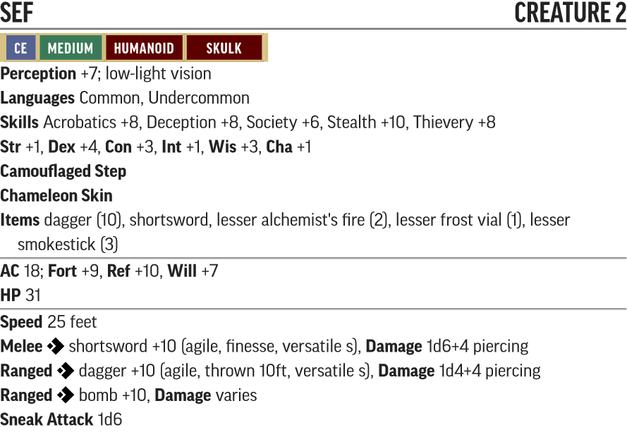

* [JSON](Sef.json)
* [PDF](Sef.pdf)

Sef is just an [Elite Skulk](http://2e.aonprd.com/Monsters.aspx?ID=805) with a bonus Throw Bomb action.

### Garmen Ulreth

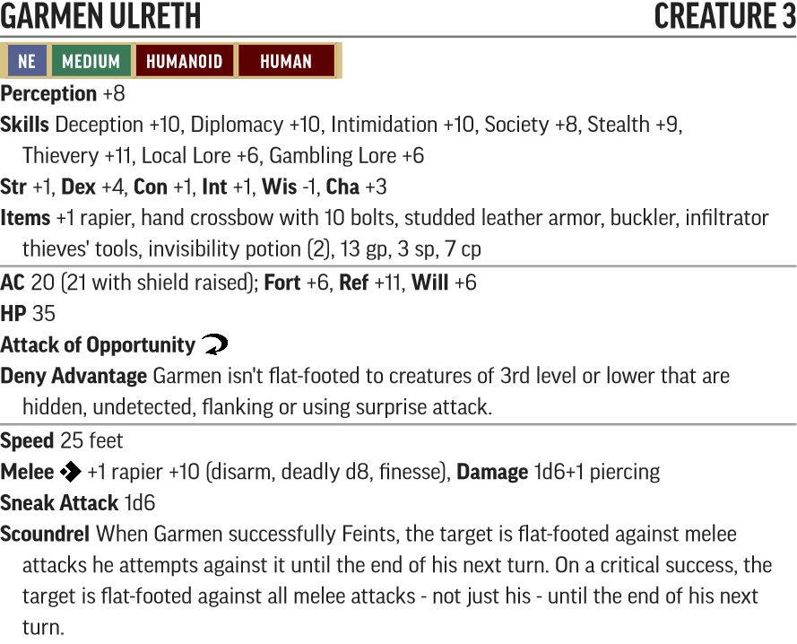

* [JSON](GarmenUlreth.json)
* [PDF](GarmenUlreth.pdf)

Garmen is built as a Level 3 Rogue with the Scoundrel Racket.

### Hetuath

* [JSON](Hetuath.json)
* [PDF](Hetuath.pdf)

Hetuath is built as a Level 3 Fighter with the same template as a Juju Zombie from 1e. Due to his many resistances and immunities he may be a much deadlier threat than his level implies.

### Sanvil Trett

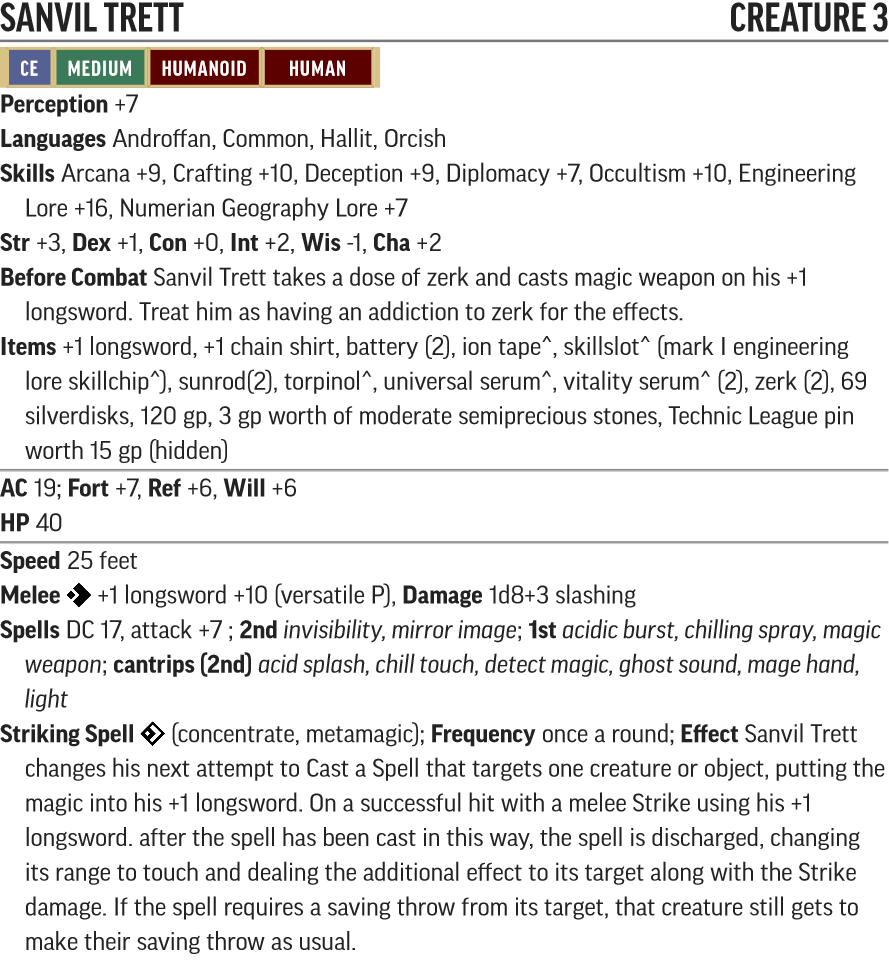

* [JSON](SanvilTrett.json)
* [PDF](SanvilTrett.pdf)

Sanvil Trett is built as a Level 3 Magus, kind of according to the Secrets of Magic playtest, but made a bit stronger. In the book it mentions Sanvil attempts to cast the spell *[bull's strength](https://www.d20pfsrd.com/magic/all-spells/b/bull-s-strength/)* before the start of the fight but such a spell (and most other ability boosting spells) do not exist in 2nd edition. Thus this has been replaced with a dose of [zerk](http://2e.aonprd.com/Equipment.aspx?ID=629), which does about the same thing and is a nod to Sanvil's vices in his past.

#### Sanvil Trett's Items

* 2x [Batteries^](/Technology%20Guide/Gear/README.md#battery)
* [Ion tape^](/Technology%20Guide/Gear/README.md#ion-tape)
* [Skillslot^](/Technology%20Guide/Cybertech/README.md#skillslot)
* [Mark I Engineering Lore Skillchip^](/Technology%20Guide/Gear/README.md#skillchip)
* [Torpinol^](/Technology%20Guide/Pharmaceuticals/README.md#torpinol)
* [Universal serum^](../Items/README.md#universal-serum)
* 2x [Vitality serum^](../Items/README.md#vitality-serum)

### Vrilledt

* [JSON](Vrilledt.json)
* [PDF](Vrilledt.pdf)

Vrilledt is a Vegepygmy scaled to Level 3 and given some fighter feats.

### Khonnir Baine

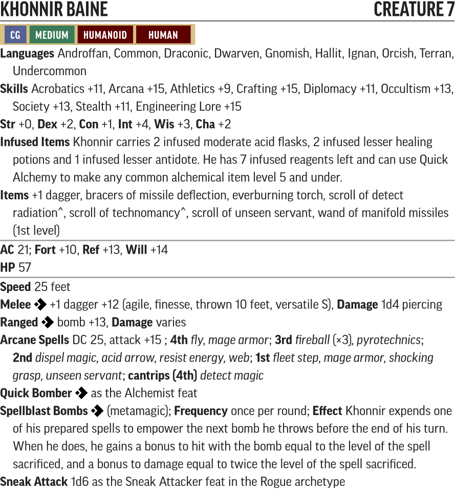

* [JSON](KhonnirBaine.json)
* [PDF](KhonnirBaine.pdf)

Khonnir Baine is built as an evocation wizard with some alchemist and rogue feats. He has been scaled up to Level 7 because they nerfed wizards too hard in 2e.

#### Khonnir Baine's Items

* *Scroll of [detect radiation^](/Technology%20Guide/README.md#detect-radiation)*
* *Scroll of [technomancy^](/Technology%20Guide/Gear/README.md#ion-tape)*

### Meyanda

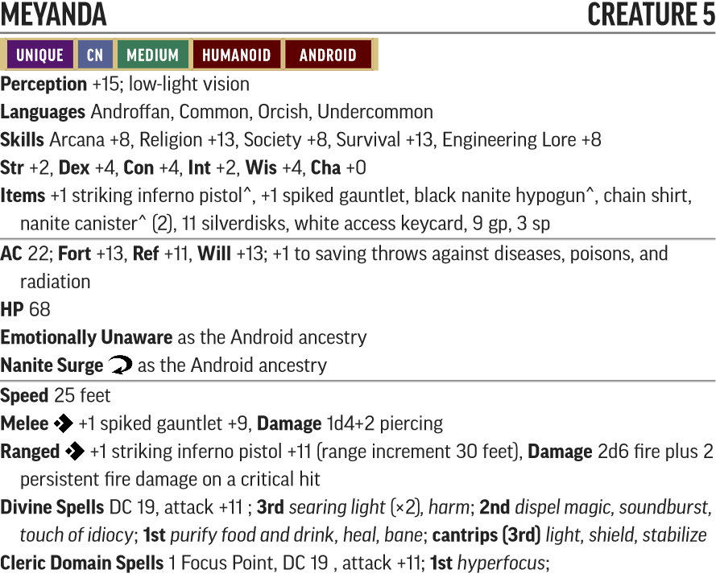

* [JSON](Meyanda.json)
* [PDF](Meyanda.pdf)

Meyanda is built as a Level 5 Android Cleric with a Harmful Font under the [delirium domain](http://2e.aonprd.com/Domains.aspx?ID=43).

#### Meyanda's Items

* *[+1 striking inferno pistol^](../Items/README.md#inferno-pistol)*
* [Black nanite hypogun^](/Technology%20Guide/Gear/README.md#nanite-hypogun)
* 2x [Nanite canister^](/Technology%20Guide/Gear/README.md#nanite-canister)

## New Creatures

### Malfunctioning Repair Drone

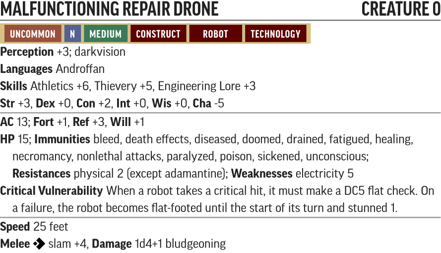

* [JSON](MalfunctioningRepairDrone.json)
* [PDF](MalfunctioningRepairDrone.pdf)

### Young Slime Mold

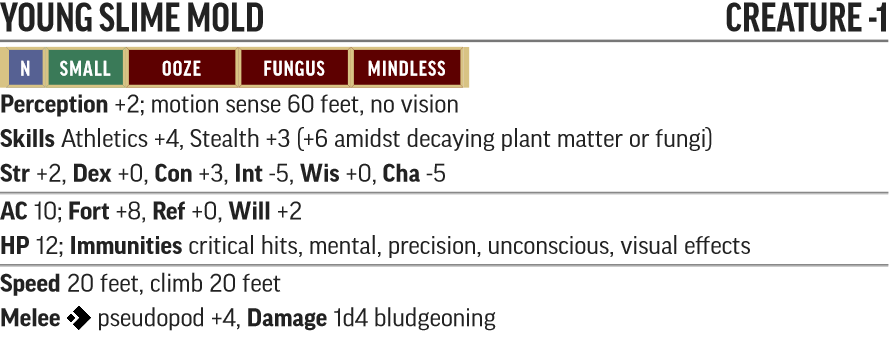

* [JSON](YoungSlimeMold.json)
* [PDF](YoungSlimeMold.pdf)

Built as a [Slime Mold](http://2e.aonprd.com/Monsters.aspx?ID=752) but scaled down to Level -1, and increased movement speed due to its smaller size.

### Repair Drone

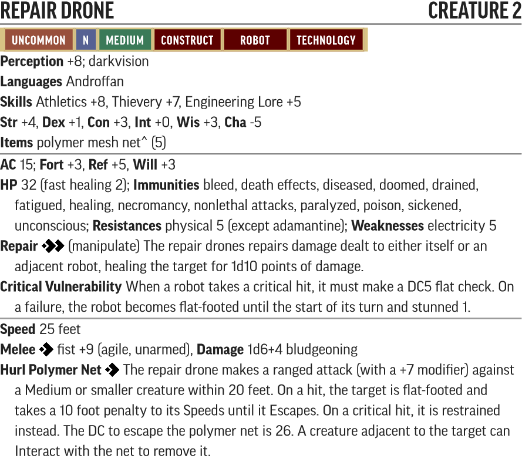

* [JSON](RepairDrone.json)
* [PDF](RepairDrone.pdf)

#### Repair Drone's Items

* 5x [Polymer mesh net^](../Items/README.md#polymer-mesh-net)

### Ghelarn

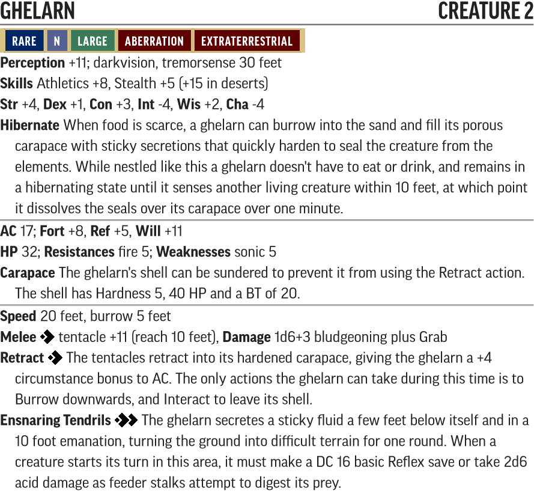

* [JSON](Ghelarn.json)
* [PDF](Ghelarn.pdf)

### Kasatha Skeleton

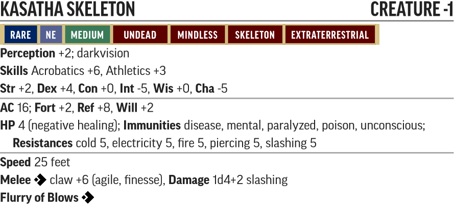

* [JSON](KasathaSkeleton.json)
* [PDF](KasathaSkeleton.pdf)

Built as a [Skeleton Guard](http://2e.aonprd.com/Monsters.aspx?ID=372) but with no weapons and Flurry of Blows.

### Boilborn

* [JSON](Boilborn.json)
* [PDF](Boilborn.pdf)

### Cerebric Fungus

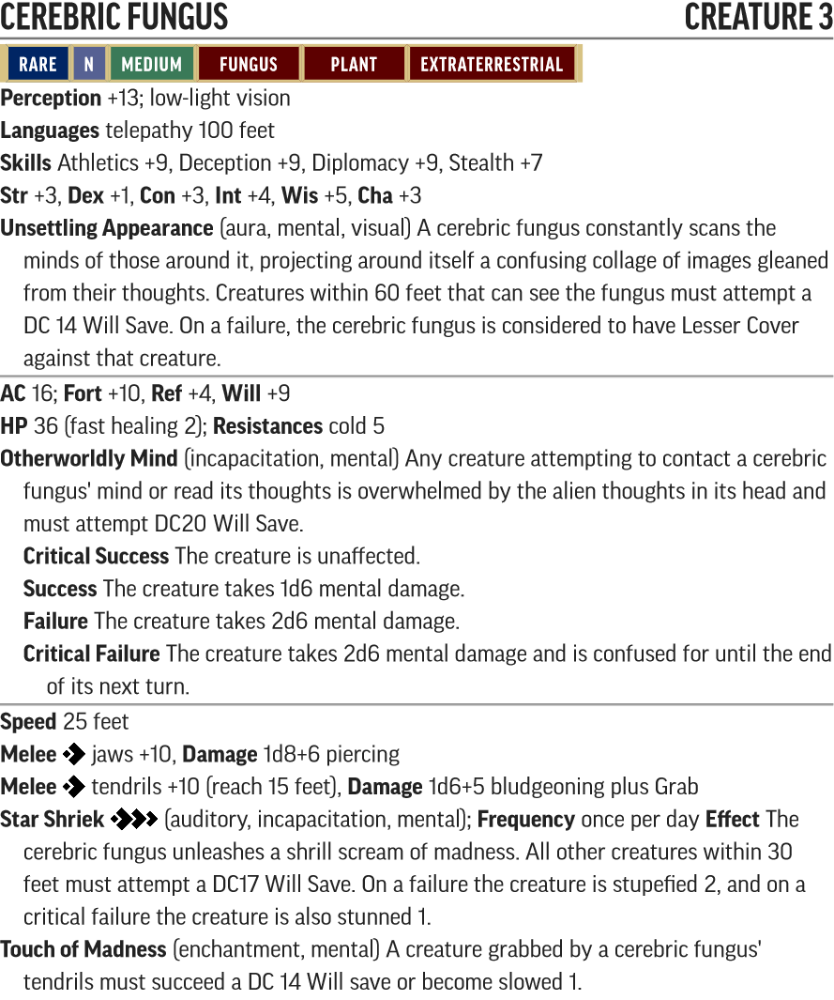

* [JSON](CerebricFungus.json)
* [PDF](CerebricFungusn.pdf)

### Vegepygmy

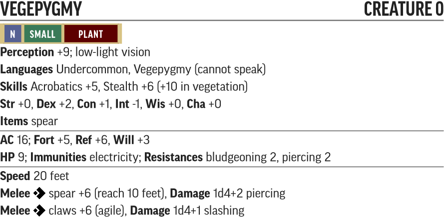

* [JSON](Vegepygmy.json)
* [PDF](Vegepygmy.pdf)

### Medical Drone

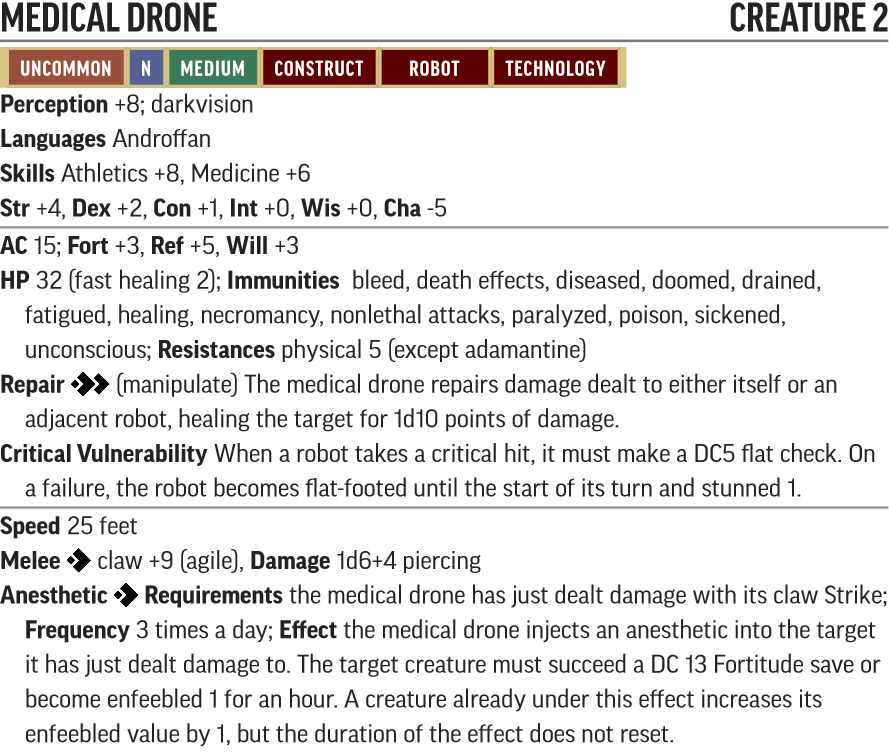

* [JSON](MedicalDrone.json)
* [PDF](MedicalDrone.pdf)

### Collector Robot

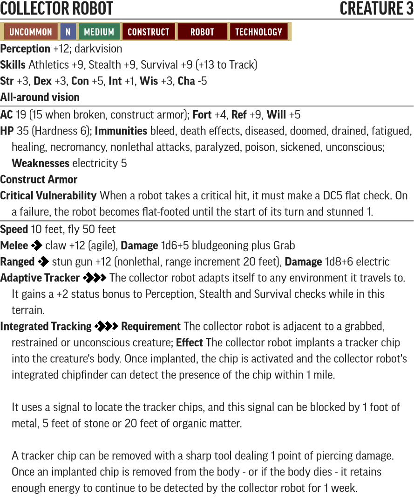

* [JSON](CollectorRobot.json)
* [PDF](CollectorRobot.pdf)

### Ropefist Thug

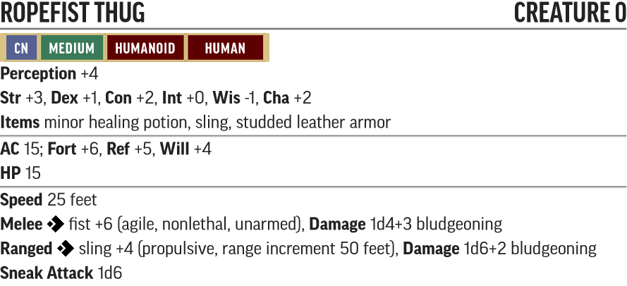

* [JSON](RopefistThug.json)
* [PDF](RopefistThug.pdf)

### Scrapwall Fanatic

* [JSON](ScrapwallFanatic.json)
* [PDF](ScrapwallFanatic.pdf)

Built as a [Orc Warrior](http://2e.aonprd.com/Monsters.aspx?ID=325) but replaced Attack of Opportunity with Sneak Attack

### Ratfolk Scrapper

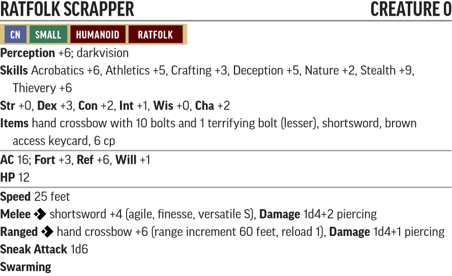

* [JSON](RatfolkScrapper.json)
* [PDF](RatfolkScrapper.pdf)

The terriffying bolt (lesser) is a version of [Terrifying Ammunition](http://2e.aonprd.com/Equipment.aspx?ID=725) but the DC is 14.

### Gearsman

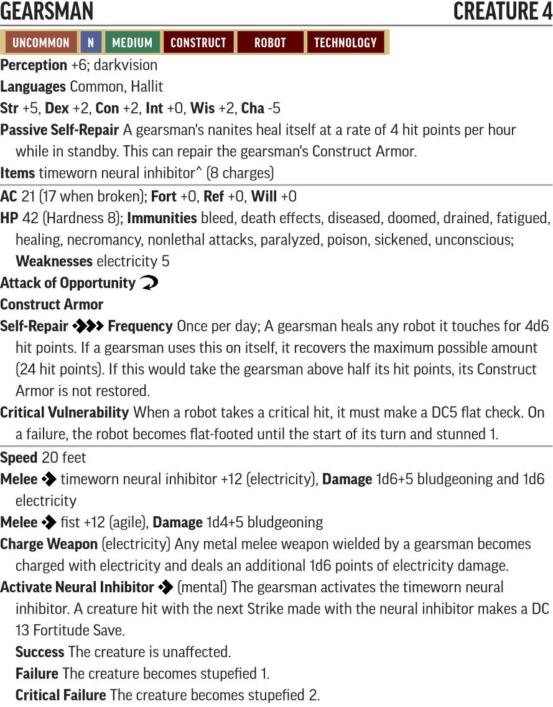

* [JSON](Gearsman.json)
* [PDF](Gearsman.pdf)

#### Gearsman's Items

* [Timeworn neural inhibitor^](../Items/README.md#neural-inhibitor)

## Additional Bestiary

### Petromin

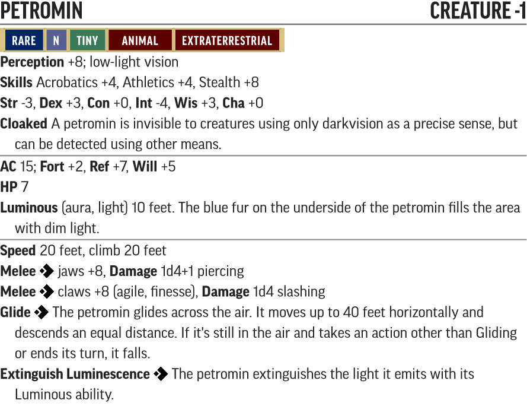

* [JSON](Petromin.json)
* [PDF](Petromin.pdf)

### Pilo

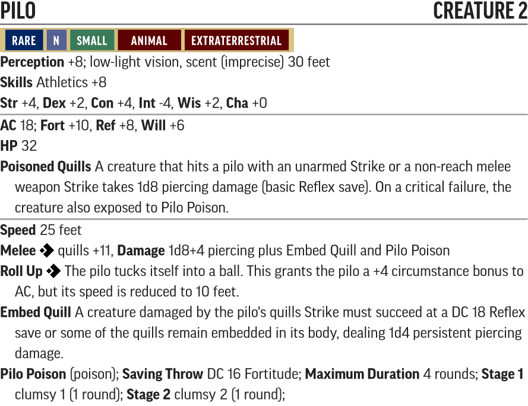

* [JSON](Pilo.json)
* [PDF](Pilo.pdf)

### Sorico

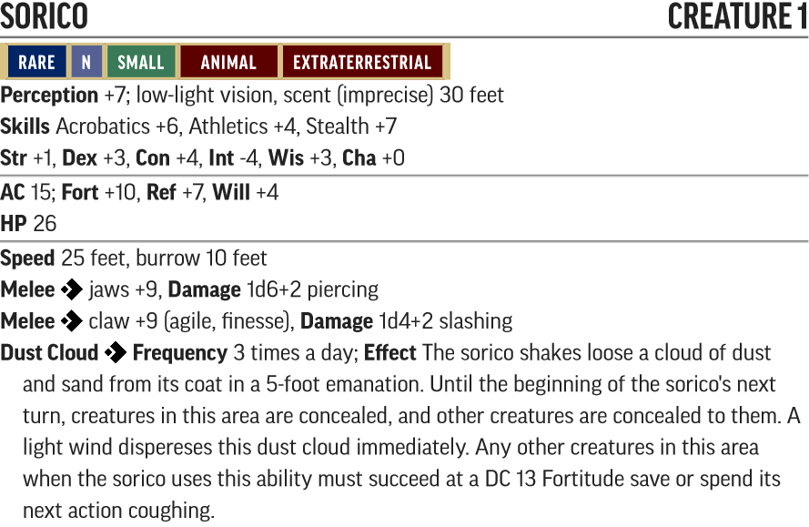

* [JSON](Sorico.json)
* [PDF](Sorico.pdf)

### Tsaalgrend

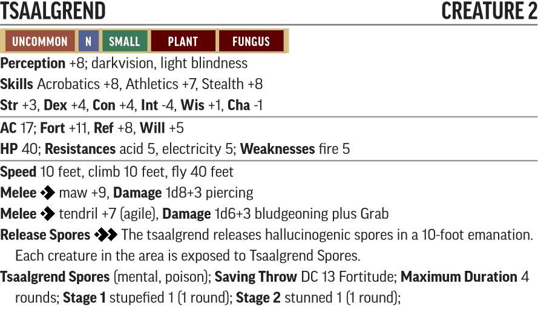

* [JSON](Tsaalgrend.json)
* [PDF](Tsaalgrend.pdf)
