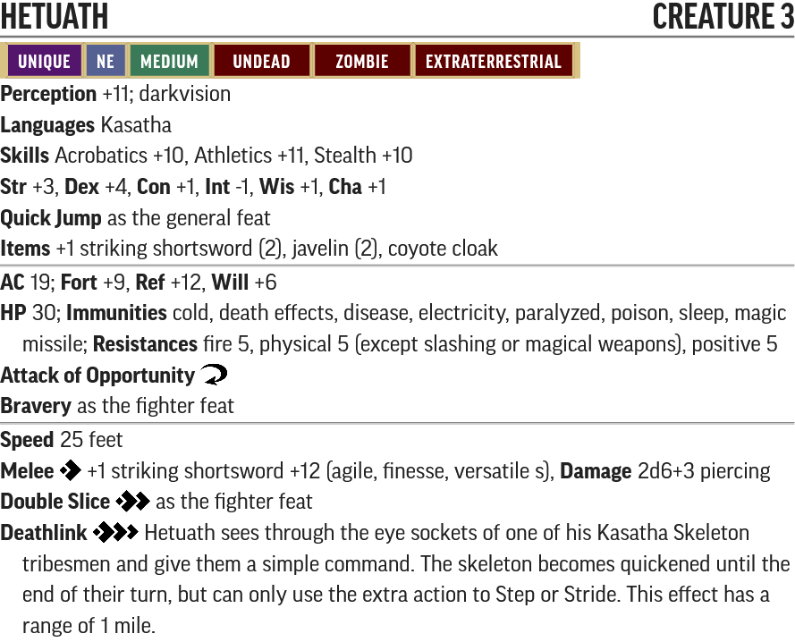
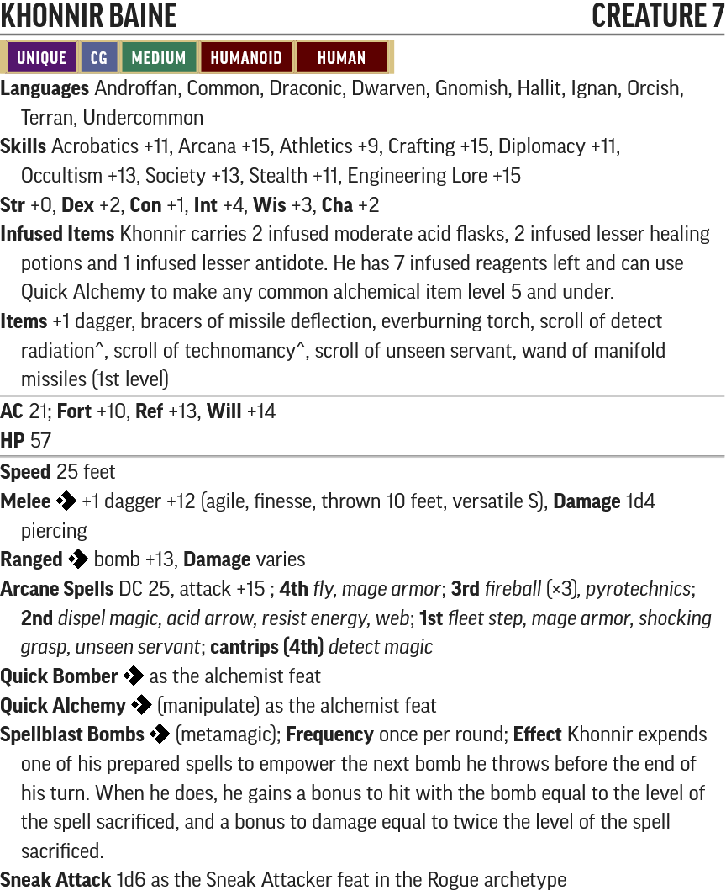
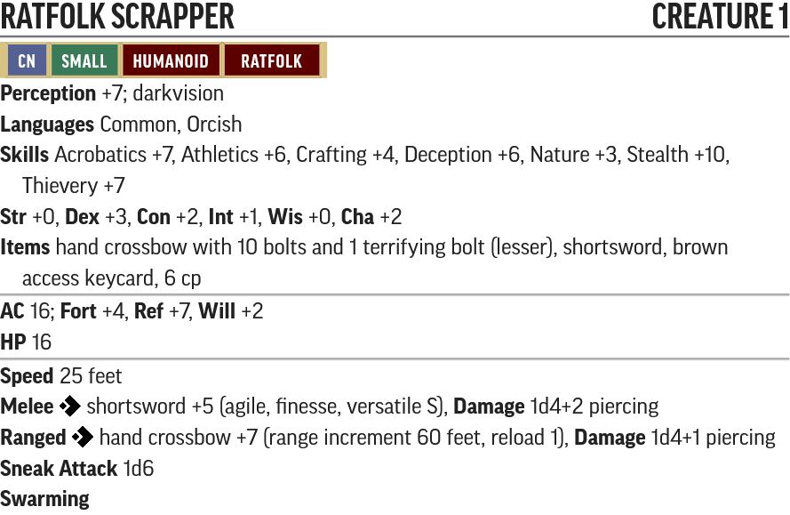
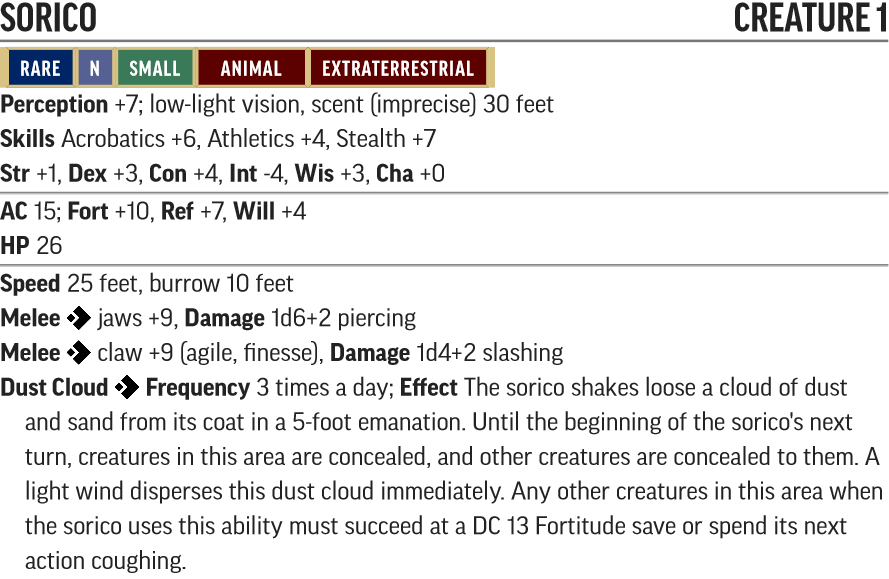

# Fires of Creation - Creature Statblocks

Any listed items with a carat (^) at the end is a item that does not exist in the current Pathfinder 2e SRD. These items will be linked below their statblock.

For creatures with new traits like Technology, Robot and Extraterrestrial, please see their entry in the [New Traits](/Technology%20Guide/Traits/README.md) document.

Use the PF2 Tools JSON files with [https://monster.pf2.tools/]. Be aware these do **NOT** import directly into FoundryVTT.

## Named NPCs

### Sef

* [PF2 Tools JSON](PF2Tools/Sef.json)
* [PDF](PDFs/Sef.pdf)

Sef is just an [Elite Skulk](http://2e.aonprd.com/Monsters.aspx?ID=805) with a bonus Throw Bomb action.

### Garmen Ulreth

* [PF2 Tools JSON](PF2Tools/GarmenUlreth.json)
* [PDF](PDFs/GarmenUlreth.pdf)

Garmen is built as a Level 4 Rogue with the Scoundrel Racket.

### Hetuath

* [PF2 Tools JSON](PF2Tools/Hetuath.json)
* [PDF](PDFs/Hetuath.pdf)

Hetuath is built as a Level 3 Fighter with the same template as a Juju Zombie from 1e. Due to his many resistances and immunities he may be a much deadlier threat than his level implies.

### Sanvil Trett

* [PF2 Tools JSON](PF2Tools/SanvilTrett.json)
* [PDF](PDFs/SanvilTrett.pdf)

In the book it mentions Sanvil attempts to cast the spell *[bull's strength](https://www.d20pfsrd.com/magic/all-spells/b/bull-s-strength/)* before the start of the fight but such a spell (and most other ability boosting spells) do not exist in 2nd edition. Thus this has been replaced with a dose of [zerk](http://2e.aonprd.com/Equipment.aspx?ID=629), which does about the same thing and is a nod to Sanvil's vices in his past.

In addition *[magic weapon](http://2e.aonprd.com/Spells.aspx?ID=182)* is no longer a feasible spell for 2e Magus due to the action economy and has been replaced with *[shocking grasp](http://2e.aonprd.com/Spells.aspx?ID=283)*.

#### Sanvil Trett's Items

* 2x [Batteries^](/Technology%20Guide/Gear/README.md#battery)
* [Ion tape^](/Technology%20Guide/Gear/README.md#ion-tape)
* [Skillslot^](/Technology%20Guide/Cybertech/README.md#skillslot)
* [Mark I Engineering Lore Skillchip^](/Technology%20Guide/Gear/README.md#skillchip)
* [Torpinol^](/Technology%20Guide/Pharmaceuticals/README.md#torpinol)
* [Universal serum^](../Items/README.md#universal-serum)
* 2x [Vitality serum^](../Items/README.md#vitality-serum)

### Vrilledt

* [PF2 Tools JSON](PF2Tools/Vrilledt.json)
* [PDF](PDFs/Vrilledt.pdf)

Vrilledt is a [Vegepygmy^](#vegepygmy) scaled to Level 4 and given some fighter feats.

### Khonnir Baine

* [PF2 Tools JSON](PF2Tools/KhonnirBaine.json)
* [PDF](PDFs/KhonnirBaine.pdf)

Khonnir Baine is built as an evocation wizard with some alchemist and rogue feats. He has been scaled up to Level 7 because they nerfed wizards too hard in 2e.

#### Khonnir Baine's Items

* *Scroll of [detect radiation^](/Technology%20Guide/README.md#detect-radiation)*
* *Scroll of [technomancy^](/Technology%20Guide/Gear/README.md#ion-tape)*

### Meyanda

* [PF2 Tools JSON](PF2Tools/Meyanda.json)
* [PDF](PDFs/Meyanda.pdf)

Meyanda is built as a Level 6 Android Cleric with a Harmful Font under the [delirium domain](http://2e.aonprd.com/Domains.aspx?ID=43).

#### Meyanda's Items

* *[+1 striking inferno pistol^](../Items/README.md#inferno-pistol)*
* [Black nanite hypogun^](/Technology%20Guide/Gear/README.md#nanite-hypogun)
* 2x [Nanite canister^](/Technology%20Guide/Gear/README.md#nanite-canister)

## New Creatures

### Malfunctioning Repair Drone

* [PF2 Tools JSON](PF2Tools/MalfunctioningRepairDrone.json)
* [PDF](PDFs/MalfunctioningRepairDrone.pdf)

### Young Slime Mold

* [PF2 Tools JSON](PF2Tools/YoungSlimeMold.json)
* [PDF](PDFs/YoungSlimeMold.pdf)

Built as a [Slime Mold](http://2e.aonprd.com/Monsters.aspx?ID=752) but scaled down to Level -1, and increased movement speed due to its smaller size.

### Repair Drone

* [PF2 Tools JSON](PF2Tools/RepairDrone.json)
* [PDF](PDFs/RepairDrone.pdf)

#### Repair Drone's Items

* 5x [Polymer mesh net^](../Items/README.md#polymer-mesh-net)

### Ghelarn

* [PF2 Tools JSON](PF2Tools/Ghelarn.json)
* [PDF](PDFs/Ghelarn.pdf)

### Kasatha Skeleton

* [PF2 Tools JSON](PF2Tools/KasathaSkeleton.json)
* [PDF](PDFs/KasathaSkeleton.pdf)

Built as a [Skeleton Guard](http://2e.aonprd.com/Monsters.aspx?ID=372) but with no weapons and Flurry of Blows.

### Boilborn

* [PF2 Tools JSON](PF2Tools/Boilborn.json)
* [PDF](PDFs/Boilborn.pdf)

### Cerebric Fungus

* [PF2 Tools JSON](PF2Tools/CerebricFungus.json)
* [PDF](PDFs/CerebricFungusn.pdf)

### Vegepygmy

* [PF2 Tools JSON](PF2Tools/Vegepygmy.json)
* [PDF](PDFs/Vegepygmy.pdf)

### Medical Drone

* [PF2 Tools JSON](PF2Tools/MedicalDrone.json)
* [PDF](PDFs/MedicalDrone.pdf)

### Collector Robot

* [PF2 Tools JSON](PF2Tools/CollectorRobot.json)
* [PDF](PDFs/CollectorRobot.pdf)

### Ropefist Thug

* [PF2 Tools JSON](PF2Tools/RopefistThug.json)
* [PDF](PDFs/RopefistThug.pdf)

### Scrapwall Fanatic

* [PF2 Tools JSON](PF2Tools/ScrapwallFanatic.json)
* [PDF](PDFs/ScrapwallFanatic.pdf)

Built as a [Orc Warrior](http://2e.aonprd.com/Monsters.aspx?ID=325) but replaced Attack of Opportunity with Sneak Attack

### Ratfolk Scrapper

* [PF2 Tools JSON](PF2Tools/RatfolkScrapper.json)
* [PDF](PDFs/RatfolkScrapper.pdf)

The terrifying bolt (lesser) is a version of [Terrifying Ammunition](http://2e.aonprd.com/Equipment.aspx?ID=725) but the DC is 14.

### Gearsman

* [PF2 Tools JSON](PF2Tools/Gearsman.json)
* [PDF](PDFs/Gearsman.pdf)

#### Gearsman's Items

* [Timeworn neural inhibitor^](../Items/README.md#neural-inhibitor)

## Additional Bestiary

### Petromin

* [PF2 Tools JSON](PF2Tools/Petromin.json)
* [PDF](PDFs/Petromin.pdf)

### Pilo

* [PF2 Tools JSON](PF2Tools/Pilo.json)
* [PDF](PDFs/Pilo.pdf)

### Sorico

* [PF2 Tools JSON](PF2Tools/Sorico.json)
* [PDF](PDFs/Sorico.pdf)

### Tsaalgrend

* [PF2 Tools JSON](PF2Tools/Tsaalgrend.json)
* [PDF](PDFs/Tsaalgrend.pdf)
