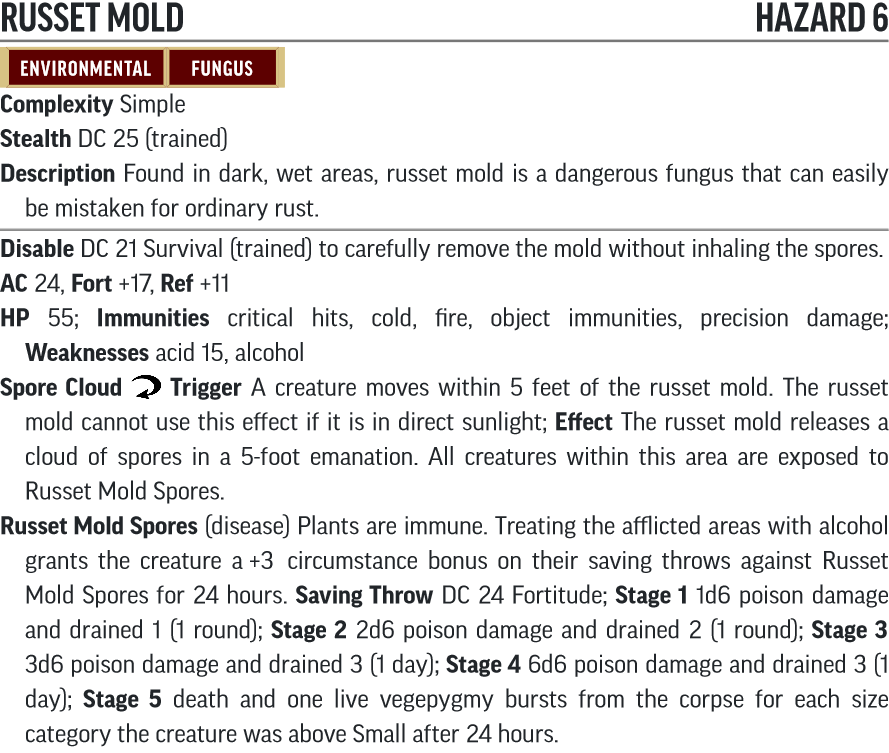
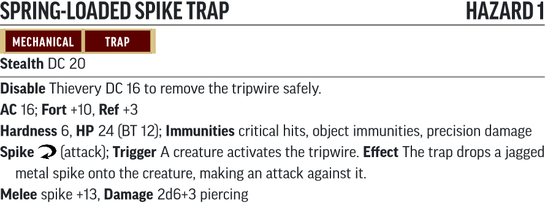
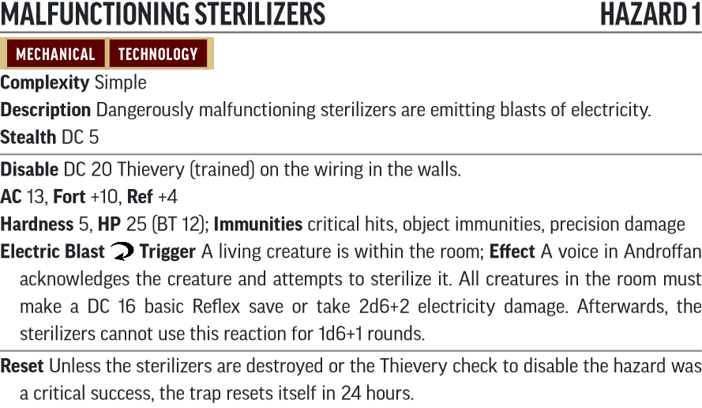
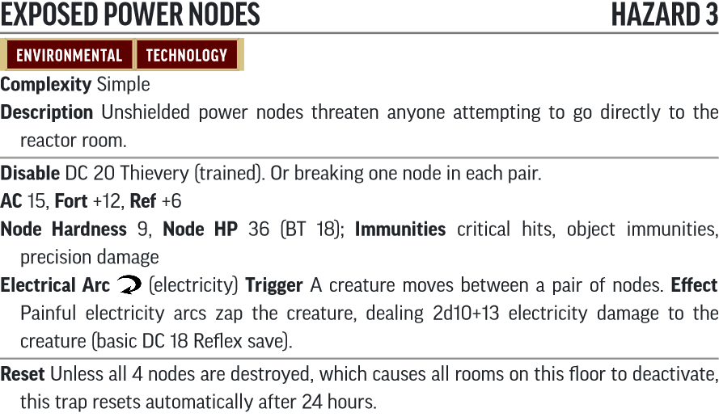

# Hazard Statblocks

## A. Black Hill Caves

### Russet Mold

* [JSON](RussetMold.json)
* [PDF](RussetMold.pdf)

### Spring-loaded Spike Trap

* [JSON](SpringLoadedSpikeTrap.json)
* [PDF](SpringLoadedSpikeTrap.pdf)

Based on [Spear Launcher](http://2e.aonprd.com/Hazards.aspx?ID=4)

## B. Habitat Dome

### Malfunctioning Sterilizers

* [JSON](MalfunctioningSterilizers.json)
* [PDF](MalfunctioningSterilizers.pdf)

## D. Engineering Deck

### Exposed Power Nodes

* [JSON](ExposedPowerNodes.json)
* [PDF](ExposedPowerNodes.pdf)
