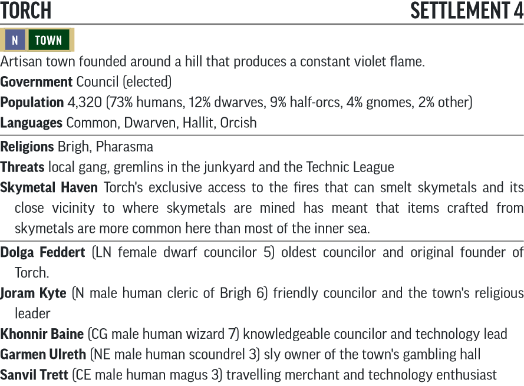

# Fires of Creation Lv 1-4

## Table of Contents

- [Part 1: A Dying Torch](#part-1-a-dying-torch)
- [Part 2: Black Hill Caves](#part-2-black-hill-caves)
- [Torch Event 1: Invitation to Silverdisk Hall](#torch-event-1-invitation-to-silverdisk-hall)
- [Part 3: The Buried World](#part-3-the-buried-world)
- [Torch Event 2: Meeting Sanvil Trett](#torch-event-2-meeting-sanvil-trett)
- [Part 4: Technological Terrors](#part-4-technological-terrors)
- [Torch Event 3: Sanvil's Betrayal](#torch-event-3-sanvils-betrayal-40-xp---trivial-threat)
- [Torch Event 4: Saving Khonnir Baine](#torch-event-4-saving-khonnir-baine)
- [Torch Event 5: Garmen's Warehouse](#torch-event-5-garmens-warehouse-100-xp---moderate-threat)
- [Part 5: Meltdown](#part-5-meltdown)
- [Torch Gazetteer](#torch-gazetteer)
- [Torch Encounters](#torch-encounters)

## General GM Information

- While the skills have been converted into appropriate action checks, the DCs themselves have not been converted into PF2e's DCs. You may wish to adjust them to fit if they aren't playing well.
- Links that end with a carat (^) are custom converted content and will take you to their statblock in this repository. Links without it take you to [Archives of Nethys](https://2e.aonprd.com/) or another SRD source.

## Advancement Track

There generally aren't enough encounters in this chapter for characters to level up so play fast and loose with rewarding players for story beats. This conversion makes an attempt at providing some extra XP to boost players into the correct levels at the right spots, but if you find you're lacking don't be shy to send some enemies at the players while they're in town using the [Torch Encounters](#torch-encounters) table.

Level | XP Progression          | Milestone
------|-------------------------|----------
1     | PCs begin at Lv 1       | PCs begin at Lv 1
2     | Around Part 3, B7       | After completing Part 2
3     | After completing Part 4 | After completing Part 4
4     | After completing Part 5 | After completing Part 5

## Part 1: A Dying Torch

### Missing Councilor

The bounty for finding Khonnir Baine is 250 gp, and a *scroll of [raise dead](http://2e.aonprd.com/Spells.aspx?ID=243)* if they bring Khonnir Baine back alive. Similarly, the bounty for reigniting Torch is also 250 gp.

### Talking with the Council

- **XP Award:** Grant the PCs 80 XP for finally starting.

### Visiting the Foundry (30 XP, Trivial Threat)

- **Creatures:**
  - 1x [Malfunctioning Repair Drone^](Creatures/README.md#malfunctioning-repair-drone)

## Part 2: Black Hill Caves

A common theme with this chapter is that there will be a "jackpot" loot pile that is incredibly difficult to get to, but the loot pile will usually contain almost as much as the rest of the dungeon combined. Due to its difficulty however it's expected the PCs will never see it. Therefore the loot breakdowns will be between "expected loot" and "maximum loot"

Expected Loot

Permanent Items                  | Consumable Items | Treasure             | Total Value
---------------------------------|------------------|----------------------|------------
**3rd** 1,  **2nd** 1, **1st** 1 | **1st** 2        | 72 gp 5 sp 9 cp      | 173 gp 5 sp 9 cp

Maximum Loot

Permanent Items                  | Consumable Items     | Treasure             | Total Value
---------------------------------|----------------------|----------------------|------------
**3rd** 2,  **2nd** 2, **1st** 9 | **3rd** 3, **1st** 3 | 108 gp 8 sp 9 cp     | 350 gp 7 sp 9 cp

XP Breakdown

Encounters | Story Awards | Total
-----------|--------------|------
516        | 170          | 686

### A1. Entry Caves (60XP, Low Threat)

- **Skills:**
  - **Identify Alchemy Action -** As foul as it is, it doesn't seem to be dangerous.
  - **Track (Survival): DC20 -** There appear to have been several people that climbed onto the five-foot-high ledge.
  - **Climb (Athletics): DC10 -** Required to climb the five-foot-high ledge, although if rope is used, the DC is reduced to 5.
- **Creatures:**
  - 3x [Flash Beetles](https://2e.aonprd.com/Monsters.aspx?ID=49)

### A2. First Expedition's Fate (60XP, Low Threat)

- **Creatures:**
  - 3x [Young Slime Mold^](Creatures/README.md#young-slime-mold)
- **Loot - Perception - DC20:** One of the dead halflings under the mounds of mold
  - Agate worth 10 sp

### A3. Stalagmite Forest (30XP Reward)

- **Skills:**
  - **Recall Knowledge (Torch Lore): DC10 -** Recalls Parda Garr was a popular brawler in town.
  - **Recall Knowledge (Medicine): DC12 -** Confirms that Parda Garr was killed by multiple stab wounds from a short-bladed weapon.
- **Loot:** Parda Garr's body
  - 4 sp, 9cp
- **XP Award:** If the PCs deliver Parda Garr's body back to the town, award them 80 XP.

### A4. Dark River Cave (60XP, Low Threat)

- **Creatures:**
  - 1x [Blindheim](http://2e.aonprd.com/Monsters.aspx?ID=570)
- **Loot:** Mostly eaten body's belt pouch
  - 2x *[Minor healing potion](https://2e.aonprd.com/Equipment.aspx?ID=186)*
  - 1x [Religious symbol of Zyphus, Silver](http://2e.aonprd.com/Equipment.aspx?ID=41)
  - 6 gp, 8 sp

### A5. Skulk Watch Post (40XP, Trivial Threat)

- **Skills:**
  - **Recall Knowledge (Society): DC20 -** Realises chalk drawings are of some unknown race.
- **Creatures:**
  - 1x [Skulk named Luepel](http://2e.aonprd.com/Monsters.aspx?ID=805)
- **Loot - Perception - DC20:** Rubble and refuse
  - 7x silverdisks
- **XP Award:** If PCs recognize the meaning of the chalk drawings, award then 30 XP.

### A6. Mold-ridden Tunnel (12XP Hazard, 40XP Reward)

- **Skills:**
  - **Climb (Athletics): DC10 -** Climb down the 10-foot ledge.
  - **Perception: DC12 -** Notices strange filaments growing along Gerrol's body.
  - **Recall Knowledge (Dungeoneering Lore): DC16 -** Recognises filaments as [russet mold](Hazards/README.md#russet-mold)
  - **Recall Knowledge (Torch Lore): DC12 -** Remembers Gerrol recently proposed to Emilia Otterbie.
  - **Request (Diplomacy): DC15 -** Convincing Emilia to cremate Gerrol's body to stop a [vegepygmy](Creatures/README.md#vegepygmy) spawning.
- **Hazard:** [Brown Mold](http://2e.aonprd.com/Hazards.aspx?ID=35)
- **Loot:** Gerrol Sonder's body
  - 1x *[+1 hand crossbow](http://2e.aonprd.com/Weapons.aspx?ID=69)* with 5 Bolts
  - 1x [Chain shirt](http://2e.aonprd.com/Armor.aspx?ID=6)
  - 1x [Infiltrator thieves' tools](http://2e.aonprd.com/Equipment.aspx?ID=58)
  - 14 gp, 2 sp
- **XP Award:** If PCs recognize Gerrol Sonder and bring his body back to Emilia Otterbie, award them 80 XP. If PCs recognize the Russet Mold and help to deal with it, award them another 30XP. Emilia's father will craft each PC a +1 weapon of their choice, but this is only delivered once they finish Part 2.

### A7. Skulk Lair (80 - 180XP, Moderate to Extreme Threat)

- **Skills:**
  - **Climb (Athletics): DC10 -** Scramble down west side of cave.
  - **Climb (Athletics): DC15 -** Scaling down slope to Nar-Voth.
- **Creatures:**
  - 2x [Skulks named Brath and Yadriss](http://2e.aonprd.com/Monsters.aspx?ID=805)
  - 1x [Skulk named Luepel from A5](http://2e.aonprd.com/Monsters.aspx?ID=805) as reinforcement
  - 1x [Elite Skulk named Sef^](Creatures/README.md#Sef) as reinforcement

### A9. Junkyard Cave (60XP, Low Threat)

- **Creatures:**
  - 1x [Elite Skulk named Sef](http://2e.aonprd.com/Monsters.aspx?ID=805)
- **Loot:** If PCs finish Sef's request
  - A Brown-level access keycard for each PC.
  - 49x silverdisks
- **Loot:** If PCs defeat Sef, they find her stash - or she offers them begging for mercy
  - 3x [Studded leather armor](http://2e.aonprd.com/Armor.aspx?ID=5)
  - 1x [Buckler](http://2e.aonprd.com/Shields.aspx?ID=1)
  - 1x [Shortbow](http://2e.aonprd.com/Weapons.aspx?ID=77) with 11 arrows
  - 1x [Rapier](http://2e.aonprd.com/Weapons.aspx?ID=36)
  - 2x [Shortsword](http://2e.aonprd.com/Weapons.aspx?ID=43)
  - 1x *[+1 sap](http://2e.aonprd.com/Weapons.aspx?ID=37)*
  - 2x *[Lesser healing potion](http://2e.aonprd.com/Equipment.aspx?ID=186)*
  - 1x [Sunrod](http://2e.aonprd.com/Equipment.aspx?ID=137)
  - 1x *[Scroll of comprehend language](http://2e.aonprd.com/Spells.aspx?ID=46)*
  - 1x [Infiltrator thieves' tools](http://2e.aonprd.com/Equipment.aspx?ID=58)
  - 29 gp, 3 sp
- **XP Awards:**
  - If PCs reach an agreement with Sef, give them XP as if they had defeated her and the skulks in combat (180 XP)
  - If PCs finish Sef's request of clearing out the Gremlin Caves, grant them 80 XP.

### A10. Gremlin Caves (144XP, Moderate to Severe Threat)

Gremlin Caves are split into rooms marked A10a and A10b. Each one of these marked rooms contains the listed encounters.

#### A10a. Spring-loaded Spike Trap (8XP Hazard)

- **Hazard:** [Spring-loaded Spike Trap^](Hazards/README.md#spring-loaded-spike-trap)

#### A10b. Gremlin (40 XP, Trivial Threat)

- **Creatures:**
  - 1x [Jinkin Gremlin](http://2e.aonprd.com/Monsters.aspx?ID=247)

### A11. Jazvit's Lair (60XP, Low Threat)

**NB** Jinkin Gremlins in PF1e could cast *dimension door* at will, which was used to explain their presence in these caves. This was removed when they were translated into 2e, likely for balance reasons. However this creates a weird plothole. Come up with your own explanation for how these Gremlins got in, and how they're able to resupply their traps without ever leaving the cave (I used a fey portal).

- **Creatures:**
  - 1x [Jazvit, Elite Jinkin Gremlin](http://2e.aonprd.com/Monsters.aspx?ID=247)

The wall here has Hardness 24, HP 96 (BT 48), if the PCs want to try smashing.

## Torch Event 1: Invitation to Silverdisk Hall

[Garmen Ulreth^](Creatures/README.md#garmen-ulreth) gives the PCs a certificate for 15x silverdisks that can be exchanged at Silverdisk Hall.

- **Skills:**
  - **Recall Knowledge (Torch Lore): DC10 -** Knows Garmen Ulreth is someone with influence.
  - **Recall Knowledge (Torch Lore): DC20 -** Recalls Garmen Ulreth is associated with the Ropefists.
- **Creatures:** If the PCs cause trouble at Silverdisk Hall
  - 3x [Elite Bodyguards](http://2e.aonprd.com/NPCs.aspx?ID=921)
  - [Garmen Ulreth^](Creatures/README.md#garmen-ulreth)
- **XP Awards:** If the PCs do well gambling, award them 30 XP.

## Part 3: The Buried World

Expected Loot

Permanent Items      | Consumable Items     | Treasure | Total Value
---------------------|----------------------|----------|------------
**4th** 2, **3rd** 1 | **3rd** 1, **1st** 5 | 0        | 289 gp 8 sp

Maximum Loot

Permanent Items                  | Consumable Items     | Treasure | Total Value
---------------------------------|----------------------|----------|------------
**4th** 2, **3rd** 2,  **1st** 1 | **3rd** 1, **1st** 7 | 0        | 339 gp 8 sp

XP Breakdown

Encounters | Story Awards | Total
-----------|--------------|------
406        | 110          | 516

### B2. Guardian on Standby (60XP, Low Threat)

- **Creatures:**
  - 1x [Repair Drone^](Creatures/README.md#repair-drone)
- **Loot:** On the repair drone (if defeated)
  - 5x [Polymer mesh net^](Items/README.md#polymer-mesh-net)

### B3. Wildlife Staging Room

- **Loot - Perception - DC20** Rubble
  - 1x [Grippers^](/Technology%20Guide/Gear/README.md#grippers)
  - 1x [Black e-pick^](/Technology%20Guide/Gear/README.md#e-pick)
  - 2x [Batteries^](/Technology%20Guide/Gear/README.md#battery)

### B5. Functional Biolock

If the PCs restore power to the area (see [B12](#b12-habitat-controls-80xp-reward)) the Biolock can cast *[remove disease](http://2e.aonprd.com/Spells.aspx?ID=251)* once a day at Counteract Level 5 with a +18 modifier.

### B6. Taboo Cavern (60 XP, Low Threat)

- **Creatures:**
  - 1x [Ghelarn^](Creatures/README.md#ghelarn)

### B7. Alien Habitat (140 XP, Trivial to Severe Threat)

- **Skills:**
  - **Climb (Athletics): DC25 -** To scale the dome's walls.
  - **Perception: DC15 -** Able to see a glow coming from [B10](#b10-glowing-tunnel-30xp-reward).
- **Creatures:**
  - 7x [Kasatha Skeleton^](Creatures/README.md#kasatha-skeleton)

### B8. Ancient Alien Den (30XP Reward)

- **XP Award:** If the PCs recognise the meaning of the Kasatha cave drawings, award them 30 XP

### B9. Ancient Alien Den (60XP, Low Threat)

- **Creatures:**
  - 1x [Elite Ghelarn^](Creatures/README.md#ghelarn)
- **Loot**
  - 1x [Lesser Vermin Repellent Agent](http://2e.aonprd.com/Equipment.aspx?ID=860)

For the sake of the vermin repellant agent, ghelarns count as an arthropod.

### B10. Glowing Tunnel (30XP Reward)

- **Skills:**
  - **Seek (Perception): DC11 -** Able to see through the hologram as if it were an *[illusory object](http://2e.aonprd.com/Spells.aspx?ID=160).*
- **XP Award:** If the PCs see through the hologram, award them 30 XP

### B11. Malfunctioning Biolock (6XP Hazard)

- **Hazard:** [Malfunctioning Sterilizers^](Hazards/README.md#malfunctioning-sterilizers)

### B12. Habitat Controls (80XP Reward)

Machines here have Hardness 18, 40 HP (20 BT).

- **XP Award:** If the PCs reactivate the habitat controls, award them 80 XP

### B13. Observation Room (80XP, Moderate Threat)

- **Skills:**
  - **Recall Knowledge (Religion): DC17 -** Identifies crude paintings as representation of Zyphus' unholy symbol.
- **Creatures:**
  - 1x [Hetuath^](Creatures/README.md#hetuath)
- **Loot:** On Hetuath's body
  - 2x *[+1 striking shortswords](http://2e.aonprd.com/Weapons.aspx?ID=43)*
  - 1x *[Coyote cloak](http://2e.aonprd.com/Equipment.aspx?ID=426)*
- **Loot - Perception - DC20:** Under the table.
  - 1x Black-level access keycard

### B16. Blocked Exit

- **Skills:**
  - **Disable a Device (Thievery): DC20 -** Dismantles the jury-rigged seal and opens the door.

## Torch Event 2: Meeting Sanvil Trett

- **Creatures:**
  - 1x [Sanvil Trett^](Creatures/README.md#sanvil-trett)

## Part 4: Technological Terrors

Expected Loot

Permanent Items                 | Consumable Items                            | Treasure  | Total Value
--------------------------------|---------------------------------------------|-----------|------------
**5th** 1, **2nd** 4, **1st** 1 | **5th** 1, **4th** 2, **3rd** 3, **1st** 65 | 38 gp 5sp | 427 gp 4 sp

Maximum Loot

Permanent Items                            | Consumable Items                            | Treasure        | Total Value
-------------------------------------------|---------------------------------------------|-----------------|------------
**5th** 1, **4th** 1, **2nd** 4, **1st** 1 | **5th** 2, **4th** 2, **3rd** 5, **1st** 66 | 38 gp 5sp       | 687 gp 4 sp

XP Breakdown

Encounters | Story Awards | Total
-----------|--------------|------
520        | 220          | 740

### C1. Security Desk

- **Skills:**
  - **Disable a Device (Thievery): DC25 -** Picks the lock to the storage closet without a black access keycard.
  - **Disable a Device (Thievery): DC30 -** Picks the lock to the white bin in the storage closet without a white access keycard.
- **Loot:** Storage Closet
  - 1x [Flashlight^](../Technology%20Guide/Gear/README.md#flashlight)
  - 3x [Batteries^](/Technology%20Guide/Gear/README.md#battery)
  - 26x Silverdisks
- **Loot:** If the PCs manage to open the white bin
  - 2x [Bang grenades^](/Technology%20Guide/Gear/README.md#grenade)
  - 1x [Flash grenade^](/Technology%20Guide/Gear/README.md#grenade)
  - 1x [Soft grenade^](/Technology%20Guide/Gear/README.md#grenade)
  - 1x [Neraplast armor^](Items/README.md#neraplast-armor)
  - 1x [Timeworn stun gun^](/Technology%20Guide/Weapons/README.md#stun-gun) with 5 charges remaining

The white glaucite bin in the room has Hardness 5, HP 20 (BT 10). But smashing it has a 50% chance of detonating all of the grenades.

### C3. Chemistry Lab (60XP, Low Threat)

- **Creatures:**
  - 2x [Boilborn^](Creatures/README.md#boilborn)

### C4. Geology Lab (60XP, Low Threat)

- **Creatures:**
  - 1x [Cerebric Fungus^](Creatures/README.md#cerebric-fungus)
- **Loot:** Box under the table
  - 3x [Timeworn flare guns^](/Technology%20Guide/Weapons/README.md#flare-gun)
- **XP Award:** Award the players 30 XP if they recognise the significance of the computer monitors.

### C5. Break Room

- **Loot:** Cabinets
  - 120x [Goo Tubes^](/Technology%20Guide/Gear/README.md#goo-tube)

### C6. Xenobiology (60XP - 160XP, Trivial to Extreme Threat)

- **Skills:**
  - **Recall Knowledge (Dungeoneering Lore): DC16 -** Recognises that the clerics succumbed to [russet mold^](Hazards/README.md#russet-mold) and spawned [vegepygmies^](Creatures/README.md#vegepygmy).
- **Creatures:**
  - 1x [Violet Fungus](http://2e.aonprd.com/Monsters.aspx?ID=853)
  - 5x [Vegepygmies^](Creatures/README.md#vegepygmy) from C7 as reinforcements
- **Loot:** Followers of Brigh's corpses
  - 4x [Religious symbol of Brigh, Silver](http://2e.aonprd.com/Equipment.aspx?ID=41)
  - 3x *[+1 light hammers](http://2e.aonprd.com/Weapons.aspx?ID=29)*
  - 1x [Chainmail](http://2e.aonprd.com/Armor.aspx?ID=9)
  - 3x *[Lesser healing potion](http://2e.aonprd.com/Equipment.aspx?ID=186)*
  - 3d10+9 sp on each body.

### C7. Greenhouse (100XP, Moderate Threat)

- **Creatures:**
  - 5x [Vegepygmies^](Creatures/README.md#vegepygmy)

### C8. Hydroponics Station (100XP, Moderate Threat)

- **Creatures:**
  - 1x [Vrilledt^](Creatures/README.md#vrilledt)
  - 2x [Vegepygmies^](Creatures/README.md#vegepygmy)
- **XP Award:** If the PCs help Vrilledt and his tribe back down to the Darklands in A7, grant them the same XP as having defeated them in battle and an additional 80 XP.

### C9. Elevator

- **Skills:**
  - **Perception: DC15 -** Notices ceiling is hollow.
  - **Climb (Athletics): DC15 -** To climb the shaft above the elevator.
  - **Disable a Device (Thievery): DC15 -** To remove the broken element from the power cable.
  - **Force Open (Athletics): DC20 -** To remove the broken element from the power cable.
  - **Repair (Crafting): DC25 -** To fix the broken element. Activity takes 8 hours instead of 10 minutes.
- **XP Award:** Award the players 30 XP for fixing the Elevator

The ceiling has Hardness 9, HP 36 (BT 18) for those that wish to climb the shaft.

### C11. Medical Lab (40XP, Low Threat)

- **Skills:**
  - **Disable a Device (Thievery): DC20 -** To shut off the malfunctioning surgery seat.
- **Creatures:**
  - 1x [Medical Drone^](Creatures/README.md#medical-drone)

A surgery seat has Hardness 5, HP 20 (BT 10) if people want to just smash it.

### C12. Sick Bay (100XP, Severe Threat)

- **Skills:**
  - **Disable a Device (Thievery): DC30 -** To open the western doors without a white access keycard.
  - **Disable a Device (Thievery): DC25 -** To open Khonnir's stasis pod without a black access keycard.
- **Creatures:**
  - 1x [Medical Drone^](Creatures/README.md#medical-drone)
  - 1x [Collector Robot^](Creatures/README.md#collector-robot)
- **Loot - Perception - DC15:** Desk.
  - 1x [Timeworn radiation detector^](/Technology%20Guide/Gear/README.md#radiation-detector)
  - 1x [Medlance^](/Technology%20Guide/Gear/README.md#medlance)
  - 1x [Timeworn brown nanite hypogun^](/Technology%20Guide/Gear/README.md#nanite-hypogun)
  - 2x [Nanite canisters^](/Technology%20Guide/Gear/README.md#nanite-canister)
  - 2x [Grade I Hemochem^](/Technology%20Guide/Pharmaceuticals/README.md#hemochem)
  - As well as all of [Khonnir Baine^](Creatures/README.md#khonnir-baine)'s gear.
- **XP Award:** Award the players 80 XP for finally finding Khonnir Baine!

## Torch Event 3: Sanvil's Betrayal (40 XP - Trivial Threat)

- **Creatures:**
  - 1x [Sanvil Trett^](Creatures/README.md#sanvil-trett)

## Torch Event 4: Saving Khonnir Baine

Each day [Khonnir Baine^](Creatures/README.md#khonnir-baine)'s stupefied value increases by 1. When it reaches stupefied 5, Khonnir can no longer speak. To remove this affliction, one needs to cast *[remove disease](http://2e.aonprd.com/Spells.aspx?ID=251)* with an effect level of 4 and a DC of 20, but the counteract check takes a -5 penalty if it is not coming from a technological device.

- **Skills:**
  - **Recall Knowledge (Medicine): DC20 -** Reveals that the serum the robots injected Khonnir with is affecting his mind.
- **XP Award:** Award the players 80 XP if they manage to cure Khonnir Baine of his sickness.

## Torch Event 5: Garmen's Warehouse (100 XP - Moderate Threat)

- **Skills:**
  - **Recall Knowledge (Torch Lore): DC15 -** To find the location of the warehouse.
  - **Gather Information (Diplomacy): DC15 -** To find the location of the warehouse.
  - **Perception: DC15 -** To notice that the front and back doors aren't actually boarded up.
  - **Pick a Lock (Thievery): DC30 -** To pick the locks on the front and back doors. Treat as a [Good Lock](http://2e.aonprd.com/Equipment.aspx?ID=30).
  - **Disable a Device (Thievery): DC20 -** To half the time spent dismantling a boarded up door and to avoid the guards noticing.
  - **Perception: DC15 -** To notice that the front and back doors aren't actually boarded up.
- **Creatures:**
  - 1x [Garmen Ulreth^](Creatures/README.md#garmen-ulreth)
  - 4x [Ropefist Thug^](Creatures/README.md#ropefist-thug)
- **Loot**
- **Loot - Perception - DC20:** Hidden panel in Garmen's Desk
  - 50x silverdisks
- **XP Award** If the PCs shut down the Power Relay and stop the headaches in Torch, award them 80 XP

A boarded up door has has Hardness 5, HP 20 (BT 10) if people want to just smash it.

## Part 5: Meltdown

Expected Loot

Permanent Items                                                  | Consumable Items                 | Treasure   | Total Value
-----------------------------------------------------------------|----------------------------------|------------|------------
**6th** 1, **5th** 3, **4th** 2, **3rd** 1, **2nd** 2, **1st** 4 | **5th** 1, **3rd** 2, **1st** 34 | 68 gp 3 sp | 1,026 gp 2 sp

Maximum Loot

Permanent Items                                                  | Consumable Items                 | Treasure   | Total Value
-----------------------------------------------------------------|----------------------------------|------------|------------
**6th** 2, **5th** 4, **4th** 2, **3rd** 1, **2nd** 2, **1st** 5 | **5th** 1, **3rd** 2, **1st** 36 | 92 gp 3 sp | 1,277 gp 7 sp

XP Breakdown

Encounters | Story Awards | Total
-----------|--------------|------
578        | 160          | 738

### D1. Improvised Kennel (40 XP - Trivial Threat)

- **Creatures:**
  - 4x [Guard Dog](http://2e.aonprd.com/Monsters.aspx?ID=124)

### D2. Power Distribution Hub (8XP Hazard)

- **Hazard:** [Exposed Power Nodes^](Hazards/README.md#exposed-power-nodes)

### D3. Loading Dock (40 XP - Trivial Threat)

- **Skills:**
  - **Pick a Lock (Thievery): DC30 -** To pick the locks on the locker. Treat as a [Good Lock](http://2e.aonprd.com/Equipment.aspx?ID=30).
- **Creatures:**
  - 2x [Scrapwall Fanatic^](Creatures/README.md#scrapwall-fanatic)
- **Loot:** If PCs manage to get into the locker
  - 1x [Timeworn autograpnel^](/Technology%20Guide/Weapons/README.md#autograpnel)
  - 1x [Timeworn panic suit^](/Technology%20Guide/Armor/README.md#panic-suit)
  - 1x [Timeworn emergency beacon^](/Technology%20Guide/Gear/README.md#emergency-beacon)
  - 2x [Batteries^](/Technology%20Guide/Gear/README.md#battery)
  - 24x silverdisks

The locker's door has Hardness 9, HP 33 (BT 18) if the PCs wish to finish the job.

### D4. Storeroom (45 XP - Trivial Threat)

- **Creatures:**
  - 3x [Ratfolk Scrapper^](Creatures/README.md#ratfolk-scrapper)

### D5. Engineering Lounge (100 XP - Moderate Threat)

- **Creatures:**
  - 4x [Ratfolk Scrapper^](Creatures/README.md#ratfolk-scrapper)
  - 2x [Scrapwall Fanatic^](Creatures/README.md#scrapwall-fanatic)
- **Loot:** Goo Tube Vending Machine
  - 32x [Goo tubes^](/Technology%20Guide/Gear/README.md#goo-tube)

### D6. Robotics Lab (60 XP - Low Threat)

- **Skills:**
  - **Recall Knowledge (Society): DC15 -** For a PC that understands Androffan to realise this is a manufacturing lab.
  - **Disable a Device (Thievery): DC30 -** For a PC to destroy the machine.
- **Creatures:**
  - 2x [Repair Drone^](Creatures/README.md#repair-drone)
- **XP Award:** When the PCs activate the command core reboot for the first time, award them XP for any robots they have not yet defeated from Part 3 onwards. If they manage to destroy the command core, award them 80XP.

The machine has Hardness 18, HP 72 (BT 36) if PCs can't disable the machine and want to try smashing it.

### D7. Fabrication Lab (60XP - Low Threat)

- **Creatures:**
  - 1x [Gearsman^](Creatures/README.md#gearsman)
- **Loot:** Large machine to the south.
  - 1x [Timeworn chemalyzer^](/Technology%20Guide/Gear/README.md#chemalyzer)
- **Loot:** Gearsman
  - 1x [Timeworn neural inhibitor^](Items/README.md#neural-inhibitor) with 8 charges
- **Loot - Perception - DC22:** Behind a monitor in the northwest.
  - 1x White-level access keycard

### D8. Navigation Control Room (60XP - Low Threat)

- **Skills:**
  - **Recall Knowledge (Religion): DC10 -** Recognises religious overtones of altar.
  - **Recall Knowledge (Religion): DC15 -** Recognises altar is dedicated to no known god.
- **Creatures:**
  - 1x [Gargoyle](http://2e.aonprd.com/Monsters.aspx?ID=210)
- **Loot:** Pile of Junk before the altar
  - 1x [Timeworn veemod goggles^](/Technology%20Guide/Gear/README.md#veemod-goggles)
  - 1x [Black veemod^](/Technology%20Guide/Gear/README.md#veemod)
  - 1x [Timeworn medlance^](/Technology%20Guide/Gear/README.md#medlance)
  - 2x [Ion tape^](/Technology%20Guide/Gear/README.md#ion-tape)
  - 1x [Zipstick^](/Technology%20Guide/Gear/README.md#zipstick)
  - 1x [Timeworn proximity helmet](Items/README.md#proximity-helmet)
  - 48x silverdisks

### D9. Reactor Core (120XP - Severe Threat)

- **Skills:**
  - **Disable a Device (Thievery): DC30 -** Deactivates the power transmitter.
- **Creatures:**
  - 1x [Collector Robot^](Creatures/README.md#collector-robot)
  - 1x [Meyanda^](Creatures/README.md#meyanda)
- **Loot:** Meyanda
  - 1x *[+1 striking inferno pistol^](Items/README.md#inferno-pistol)*
  - 1x *[+1 spiked gauntlet](https://2e.aonprd.com/Weapons.aspx?ID=11)*
  - 1x [Black nanite hypogun^](/Technology%20Guide/Gear/README.md#nanite-hypogun)
  - 1x [Chain shirt](https://2e.aonprd.com/Armor.aspx?ID=6)
  - 2x [Nanite canister^](/Technology%20Guide/Gear/README.md#nanite-canister)
  - 11x silverdisks
  - 1x White-level access keycard
  - 9 gp, 3 sp
- **XP Award:** If the PCs manage to deactivate the power transmitter and reboot the reactor, award them 80XP for concluding the adventure.

## Torch Gazetteer

### 2. General Store

**Wares** adventuring gear, *[+1](https://2e.aonprd.com/Equipment.aspx?ID=281) [flaming](https://2e.aonprd.com/Equipment.aspx?ID=295) [warhammer](https://2e.aonprd.com/Weapons.aspx?ID=47)*, *[staff of abjuration](https://2e.aonprd.com/Equipment.aspx?ID=351)*, 5 [trauma packs^](../Technology%20Guide/Gear/README.md#trauma-pack), a *[wand](https://2e.aonprd.com/Equipment.aspx?ID=368) of [technomancy^](../Technology%20Guide/README.md#technomancy)* and a [filter mask^](../Technology%20Guide/Gear/README.md#filter-mask)

**Inkrit Kollisun** (N female human shopkeep 3, Indifferent, Perception DC 18, Will DC 20)

### 11. Market Square

#### Sanvil's Stand

**Wares** [ion tape^](../Technology%20Guide/Gear/README.md#ion-tape), [zipstick^](../Technology%20Guide/Gear/README.md#zipstick), [universal serum](Items/README.md#universal-serum), 2 doses of [vitality serum^](Items/README.md#vitality-serum) and 5 [batteries^](../Technology%20Guide/Gear/README.md#battery)

**[Sanvil Trett](Creatures/README.md#sanvil-trett)** (CE male human magus 3, Indifferent, Perception DC 17, Will DC 16) Sanvil will appear to support the PCs if they mention they are exploring the caves under Black Hill.

### 12. Tempting Tonics

**Wares** alchemical poisons, antidotes, elixirs, [cureall^](../Technology%20Guide/Pharmaceuticals/README.md#cureall), grades I to IV of [hemochem^](../Technology%20Guide/Pharmaceuticals/README.md#hemochem), 2 doses of [cardioamp^](../Technology%20Guide/Pharmaceuticals/README.md#cardioamp) and 6 [medlances^](../Technology%20Guide/Gear/README.md#medlance)

**Jhestine Imierin** (N female half-elf witch 4, Indifferent, Perception DC 18, Will DC 20, Primal DC 20, Spell Attack +10)

### 15. Town Hall

**Dolga Feddert** (N female dwarf councilor 5, Indifferent, Perception DC 21, Will DC 21)

### 17. Temple of Brigh

**Wares** divine spellcasting, magical items, [flare gun^](../Technology%20Guide/Weapons/README.md#flare-gun), 3 *[scrolls](https://2e.aonprd.com/Equipment.aspx?ID=640) of [restoration](https://2e.aonprd.com/Spells.aspx?ID=258)*, a *[scroll](https://2e.aonprd.com/Equipment.aspx?ID=640) of [raise dead](https://2e.aonprd.com/Spells.aspx?ID=243)* and a *[wand](https://2e.aonprd.com/Equipment.aspx?ID=368) of [rebuke technology^](../Technology%20Guide/README.md#rebuke-technology)*

**Joram Kyte** (N male human cleric of Brigh 6, Friendly, Perception DC 24, Will DC 24, Divine DC 22, Spell Attack +12) Joram Kyte is an old friend of [Khonnir Baine^](Creatures/README.md#khonnir-baine) and will support the PCs once he hears they're looking for him.

### 21. Torch Guildhouse (Level 12)

**Wares** weapons and armor, *[+1](https://2e.aonprd.com/Equipment.aspx?ID=281) [striking](http://2e.aonprd.com/Equipment.aspx?ID=280) [cold siccatite^](/Technology%20Guide/README.md#siccatite-weapons) [longsword](http://2e.aonprd.com/Weapons.aspx?ID=31)*, *[+1](https://2e.aonprd.com/Equipment.aspx?ID=281) [mithral](http://2e.aonprd.com/Equipment.aspx?ID=377) [heavy crossbow](http://2e.aonprd.com/Weapons.aspx?ID=70)*, [adamantine bolts](http://2e.aonprd.com/Rules.aspx?ID=765), *[+1](https://2e.aonprd.com/Equipment.aspx?ID=281) [striking](http://2e.aonprd.com/Equipment.aspx?ID=280) [adamantine](http://2e.aonprd.com/Equipment.aspx?ID=374) [shock](https://2e.aonprd.com/Equipment.aspx?ID=303) [dagger](http://2e.aonprd.com/Weapons.aspx?ID=31)*, *[+2](http://2e.aonprd.com/Equipment.aspx?ID=278) [breastplate](http://2e.aonprd.com/Armor.aspx?ID=10)*, *[+1](http://2e.aonprd.com/Equipment.aspx?ID=278) [mithral](http://2e.aonprd.com/Equipment.aspx?ID=144) [chain shirt](http://2e.aonprd.com/Armor.aspx?ID=6)*, *[+2](http://2e.aonprd.com/Equipment.aspx?ID=281) [greater striking](http://2e.aonprd.com/Equipment.aspx?ID=280) [spiked](http://2e.aonprd.com/Weapons.aspx?ID=42) [steel shield](http://2e.aonprd.com/Shields.aspx?ID=3)*

**Bazlundie Otterbie** (N female human guildhead 5, Indifferent, Perception DC 22, Will DC 22)

## Torch Encounters

d%     | Result                                                           | Encounter Level
-------|------------------------------------------------------------------|----------------
01–06  | 1 [boilborn^](Creatures/README.md#boilborn)                      | 1
07–09  | 1d6 [giant rats](http://2e.aonprd.com/Monsters.aspx?ID=346)      | 1
10–13  | 1d4 [giant centipedes](http://2e.aonprd.com/Monsters.aspx?ID=77) | 1
14–18  | 1 [giant fly](http://2e.aonprd.com/Monsters.aspx?ID=673)         | 1
19–23  | 1d6 [flash beetles](http://2e.aonprd.com/Monsters.aspx?ID=49)    | 1
24–28  | 1 [vexgit gremlin](http://2e.aonprd.com/Monsters.aspx?ID=688)    | 1
29–32  | 1d6 [young slime molds^](Creatures/README.md#young-slime-mold)   | 1
33–35  | 1 [cockroach swarm](http://2e.aonprd.com/Monsters.aspx?ID=586)   | 2
36–39  | 1d6 [giant maggots](http://2e.aonprd.com/Monsters.aspx?ID=672)   | 2
40–46  | 1 [pilo^](Creatures/README.md#pilo)                              | 2
47–51  | 1d6 [Ropefist thugs^](Creatures/README.md#ropefist-thug)         | 2
52–57  | 1 [tsaalgrend^](Creatures/README.md#tsaalgrend)                  | 2
58–63  | 1d6 [vegepygmies^](Creatures/README.md#vegepygmy)                | 2
64–68  | 1 [giant flea](http://2e.aonprd.com/Monsters.aspx?ID=501)        | 3
69–74  | 1d4 [giant amoebas](http://2e.aonprd.com/Monsters.aspx?ID=751)   | 3
75–79  | 1 [vermlek](http://2e.aonprd.com/Monsters.aspx?ID=500)           | 3
80–86  | 1d4 [jinkin gremlins](http://2e.aonprd.com/Monsters.aspx?ID=247) | 3
87–91  | 1d4 [skulks](http://2e.aonprd.com/Monsters.aspx?ID=805)          | 3
92–96  | 1 [violet fungus](http://2e.aonprd.com/Monsters.aspx?ID=853)     | 3
97–100 | 1 [gray ooze](http://2e.aonprd.com/Monsters.aspx?ID=753)         | 4
