# Lords of Rust - Creature Statblocks

Any listed items with a carat (^) at the end is a item that does not exist in the current Pathfinder 2e SRD. These items will be linked below their statblock.

For creatures with new traits like Technology, Robot and Extraterrestrial, please see their entry in the [New Traits](/Technology%20Guide/Traits/README.md) document.

## Named NPCs

### Ewhar Vress

* [PF2 Tools JSON](PF2Tools/EwharVress.json)
* [PDF](PDFs/EwharVress.pdf)

Hatchet-Hand is fashioned after an [Antipaladin](https://2e.aonprd.com/NPCs.aspx?ID=961) for their proficiency in Intimidation. Their hatchet-hand has the [free-hand](https://2e.aonprd.com/Traits.aspx?ID=181) trait so people can't disarm it.

#### Ewhar Vress' Items

* 2x [Gas Grenade^](../Items/README.md#gas-grenade)
* 2x [Soothe^](../Items/README.md#soothe)

### Aldronard

* [PF2 Tools JSON](PF2Tools/Aldronard.json)
* [PDF](PDFs/Aldronard.pdf)

Aldronard is a mix of [Hungry Ghost](https://2e.aonprd.com/Monsters.aspx?ID=1863) and Chandriu Invisar from the Abomination Vaults adventure path.

### Sevroth Slaid

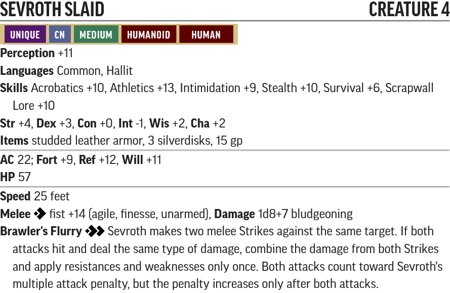

* [PF2 Tools JSON](PF2Tools/SevrothSlaid.json)
* [PDF](PDFs/SevrothSlaid.pdf)

Sevroth Slaid is built after an elite [Ganzi Martial Artist](https://2e.aonprd.com/Monsters.aspx?ID=1266). Her Brawler's Flurry skill allows her to make two strikes with both her fists or with any melee weapon without a MAP penalty, so feel free to have her pick up other weapons - perhaps confiscated from other would-be guests to Scrapwall - to really make her brawler class shine.

### Birdfood

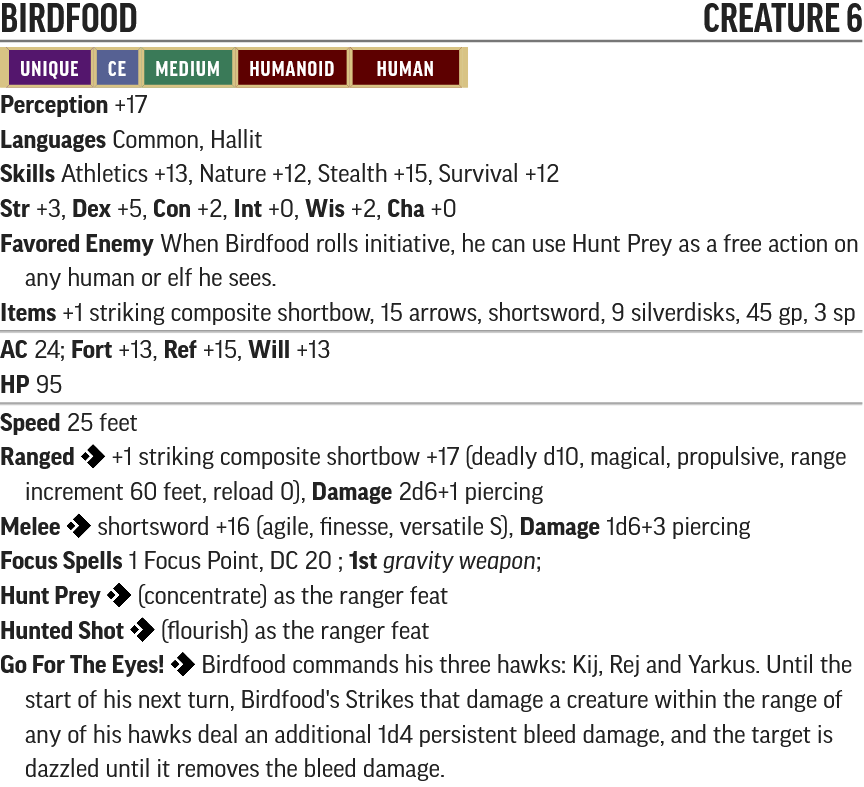

* [PF2 Tools JSON](PF2Tools/Birdfood.json)
* [PDF](PDFs/Birdfood.pdf)

Birdfood is a level 6 ranger. His composite longbow has been replaced with a composite shortbow as most of his feats in 1e was just trying to get rid of the Volley trait.

### Dinvaya Lanalei

* [PF2 Tools JSON](PF2Tools/DinvayaLanalei.json)
* [PDF](PDFs/DinvayaLanalei.pdf)

Dinvaya is built as an Elite [Priest of Pharasma]() with her spells more aligned with her spell list in 1e.

#### Dinvaya's Items

* 2x [Bang Grenade^](/Technology%20Guide/Gear/README.md#grenade)
* 1x [Inferno Grenade^](/Technology%20Guide/Gear/README.md#grenade)
* 2x [Battery^](/Technology%20Guide/Gear/README.md#battery)
* 1x [Gravity Clip^](/Technology%20Guide/Gear/README.md#gravity-clip)

### Gunshy

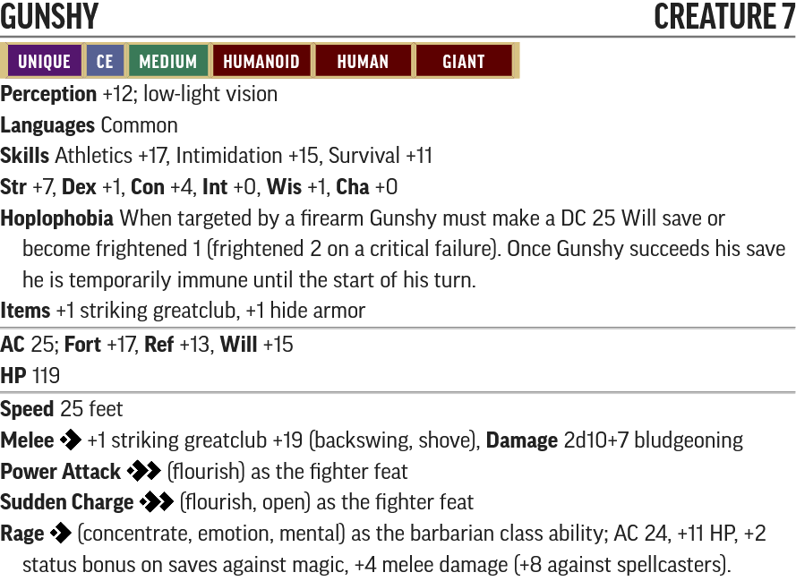

* [PF2 Tools JSON](PF2Tools/Gunshy.json)
* [PDF](PDFs/Gunshy.pdf)

Gunshy is built after a cross between an [Ogre Boss](https://2e.aonprd.com/Monsters.aspx?ID=319) and an Elite [Monster Hunter](https://2e.aonprd.com/NPCs.aspx?ID=924). Sundering weapons isn't really a mechanic in 2e and it's unlikely Gunshy will have a hand free to disarm guns, so to play up that aspect DMs may wish to have him try to smash the dropped gun after he knocks a player unconscious.

### Whiskifliss

* [PF2 Tools JSON](PF2Tools/Whiskifliss.json)
* [PDF](PDFs/Whiskifliss.pdf)

Whiskifliss is a [Ratfolk Grenadier](https://2e.aonprd.com/Monsters.aspx?ID=348) re-made as a ranger.

### Marrow

* [PF2 Tools JSON](PF2Tools/Marrow.json)
* [PDF](PDFs/Marrow.pdf)

Marrow is a reflavoured [Cult Leader](https://2e.aonprd.com/NPCs.aspx?ID=930) with necromancy spells. Don't forget about her [*mentalist's staff (greater)*](https://2e.aonprd.com/Equipment.aspx?ID=350) which has additional spells she can cast that aren't listed there.

#### Marrow's Items

* 2x [Gas Grenade^](../Items/README.md#gas-grenade)
* 4x [Soothe^](../Items/README.md#soothe)

### Redtooth

* [PF2 Tools JSON](PF2Tools/Redtooth.json)
* [PDF](PDFs/Redtooth.pdf)

#### Redtooth's Items

* [Dart Gun^](/Technology%20Guide/Weapons/README.md#dart-gun)

### Helskarg

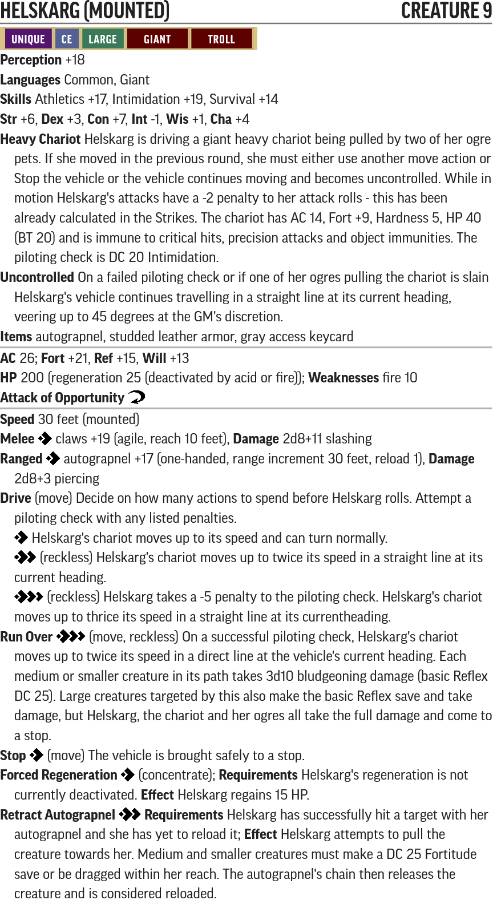

* [PF2 Tools JSON (Mounted)](PF2Tools/Helskarg-Mounted.json)
* [PF2 Tools JSON (Disounted)](PF2Tools/Helskarg-Dismounted.json)
* [PDF (Mounted)](PDFs/Helskarg-Mounted.pdf)
* [PDF (Dismounted)](PDFs/Helskarg-Dismounted.pdf)

Helskarg is a weak [Troll King](https://2e.aonprd.com/Monsters.aspx?ID=396). This is kind of a two-phase fight, with Helskarg eventually abandoning her chariot and letting any remaining ogres come join the fray.

Note that for Helskarg the autograpnel is considered a 1-handed weapon only due to her Large size. For player characters it remains a 2-handed weapon.

### Hellion

* [PF2 Tools JSON](PF2Tools/Hellion.json)
  * This should be used with [https://template.pf2.tools] instead of the usual monster tool
* [PDF](PDFs/Hellion.pdf)

Hellion is an [Artificial Intelligence](/Traits/README.md#ai) and a deity. Its physical defenses are dependent on its current host. See [Artificial Intelligence](/Traits/README.md#ai)'s trait description for more details.

### Nalakai

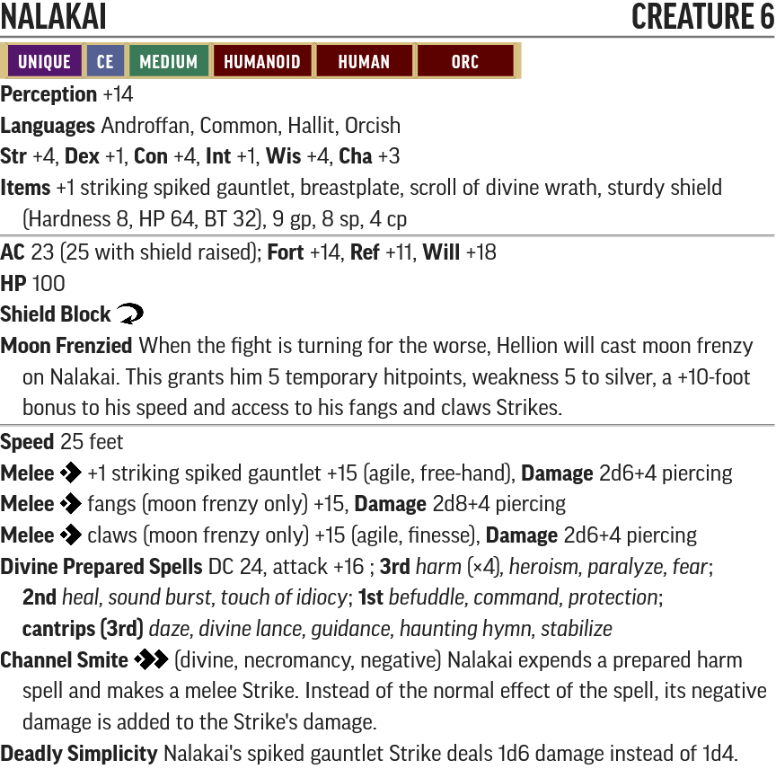

* [PF2 Tools JSON](PF2Tools/Nalakai.json)
* [PDF](PDFs/Nalakai.pdf)

Nalakai is another weak [Cult Leader](https://2e.aonprd.com/NPCs.aspx?ID=930) with a cleric base. It's worth noting that Hellion is supposed to cast [*moon frenzy*](https://2e.aonprd.com/Spells.aspx?ID=203) on Nalakai when he's in dire straits.

### Kulgara

* [PF2 Tools JSON](PF2Tools/Kulgara.json)
* [PDF](PDFs/Kulgara.pdf)

Kulgara is a level 9 rage instinct barbarian.

#### Kulgara's Items

* 1x *[+1](https://2e.aonprd.com/Equipment.aspx?ID=281) [striking](https://2e.aonprd.com/Equipment.aspx?ID=280) [chainsaw^](/Technology%20Guide/Weapons/README.md#chainsaw)*
* 1x [inferno grenade^](/Technology%20Guide/Gear/README.md#grenade)
* 1x [plasma grenade^](/Technology%20Guide/Gear/README.md#grenade)
* 1x [zero grenade^](/Technology%20Guide/Gear/README.md#grenade)
* 1x Green Access Keycard
* 10x Silverdisks

### Zagmaander

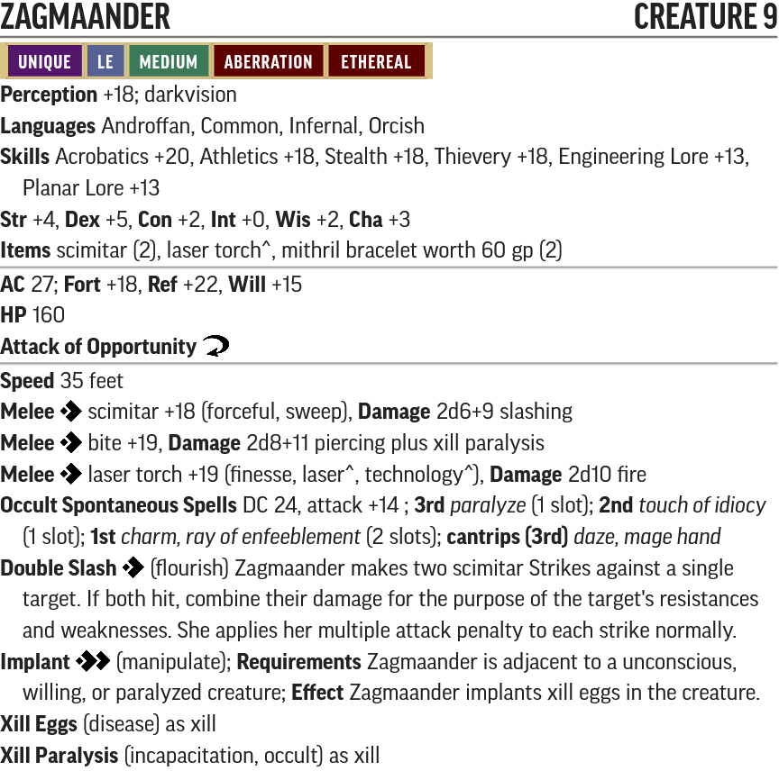

* [PF2 Tools JSON](PF2Tools/Zagmaander.json)
* [PDF](PDFs/Zagmaander.pdf)

Zagmaander is a [xill](https://2e.aonprd.com/Monsters.aspx?ID=866) brought up to level 9 with a Sorcerer dedication archetype. Her curse prevents her from using the xill Occult Innate Spell of [*plane shift*](https://2e.aonprd.com/Monsters.aspx?ID=866) to leave for the Ethereal Plane.

#### Zagmaander's Items

* 1x [Laser Torch^](/Technology%20Guide/Weapons/README.md#laser-torch)

### Dragis

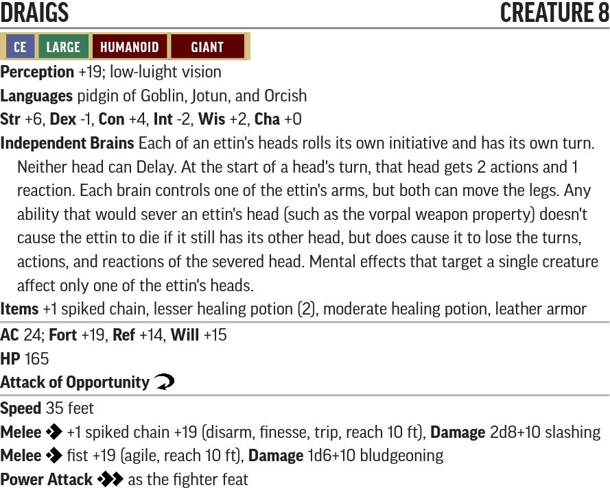

* [PF2 Tools JSON](PF2Tools/Draigs.json)
* [PDF](PDFs/Draigs.pdf)

Draigs is just an [ettin](https://2e.aonprd.com/Monsters.aspx?ID=204) brought up to level 8.

### Hellion's Chassis

* [PF2 Tools JSON](PF2Tools/HellionsChassis.json)
* [PDF](PDFs/HellionsChassis.pdf)

Hellion's Chassis is an [Aggregate^](/Traits/README.md#aggregate) with Hellion installed. The modifications have already been included in this statblock.

The chassis' plasma beam is an attack with the [plasma^](/Traits/README.md#plasma) and [beam^](/Traits/README.md#beam) traits.

#### Hellion's Chassis' Items

* 1x [Aggression Facet^](../Items/README.md#memory-facet)
* 1x [Ego Facet^](../Items/README.md#memory-facet)

## New Creatures

### Smiler

* [PF2 Tools JSON](PF2Tools/Smiler.json)
* [PDF](PDFs/Smiler.pdf)

Smilers are built as a [Archer Sentry](https://2e.aonprd.com/NPCs.aspx?ID=934) but with more focus on getting crits.

#### Smiler's Items

* [Soothe^](../Items/README.md#soothe)

### Junk Golem

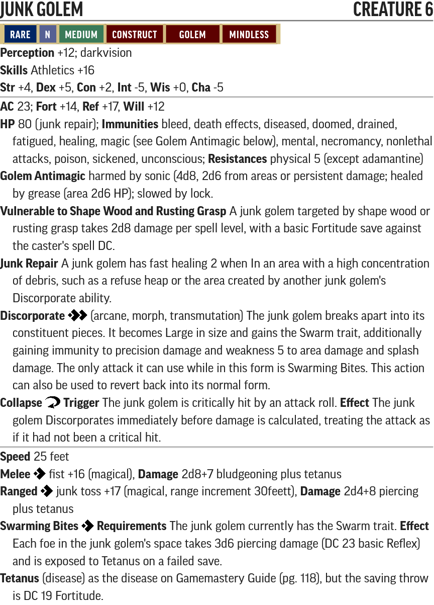

* [PF2 Tools JSON](PF2Tools/JunkGolem.json)
* [PDF](PDFs/JunkGolem.pdf)

### Rust-Risen

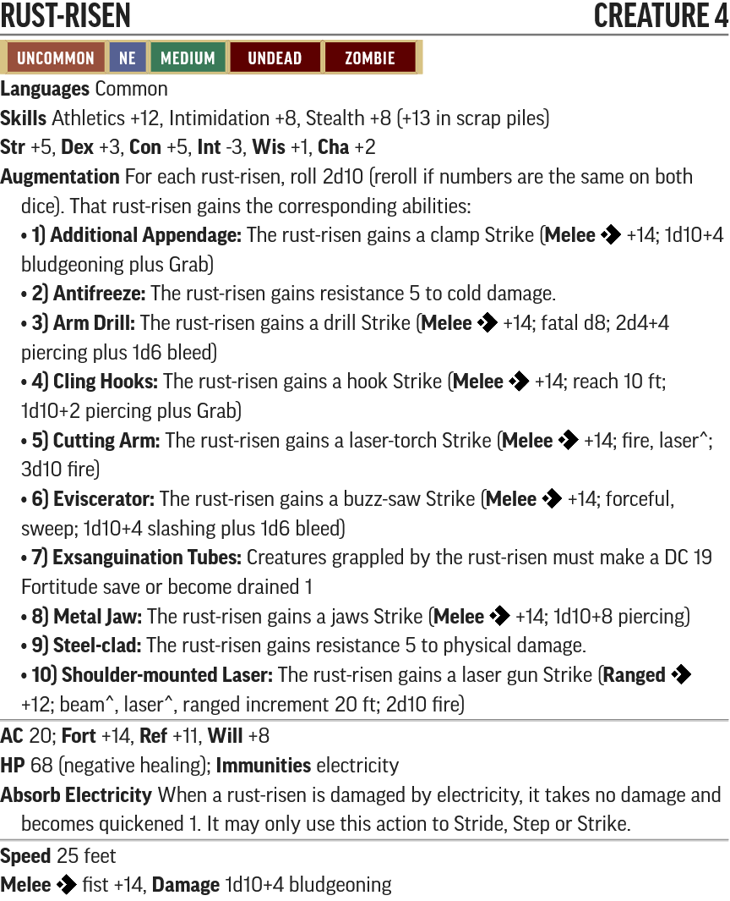

* [PF2 Tools JSON](PF2Tools/RustRisen.json)
* [PDF](PDFs/RustRisen.pdf)

No two rust-risen are meant to be the same, but feel free to pick any two augmentations you like.

### Skeletal Technician

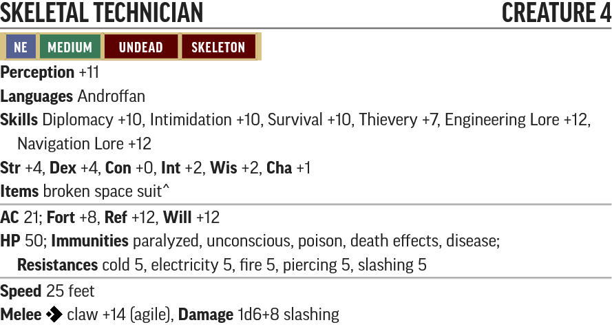

* [PF2 Tools JSON](PF2Tools/SkeletalTechnician.json)
* [PDF](PDFs/SkeletalTechnician.pdf)

#### Skeletal Technician's Items

* 1x destroyed [spacesuit^](/Technology%20Guide/Armor/README.md#spacesuit)

### Orc Fanatic

* [PF2 Tools JSON](PF2Tools/OrcFanatic.json)
* [PDF](PDFs/OrcFanatic.pdf)

If you have Foundry or have a subscription to the Pathfinder Society, this is the exact same as a Burning Sun Orc (5-6) from [#2-10: In Burning Dawn](https://paizo.com/products/btq026i8?Pathfinder-Society-Scenario-210-In-Burning-Dawn)

### Acolyte of Hellion

* [PF2 Tools JSON](PF2Tools/AcolyteOfHellion.json)
* [PDF](PDFs/AcolyteOfHellion.pdf)

Acolytes of Hellion are pretty much just the [zealot](https://2e.aonprd.com/NPCs.aspx?ID=895) NPC.

### Scrapyard Robot

* [PF2 Tools JSON](PF2Tools/ScrapyardRobot.json)
* [PDF](PDFs/ScrapyardRobot.pdf)

Note that the Scrapyard Robot's Construct Armor is only removed on a critical hit if the roll for Fall to Pieces is 2. It only loses its Construct Armor when it gets below half its HP.

### Observer Robot

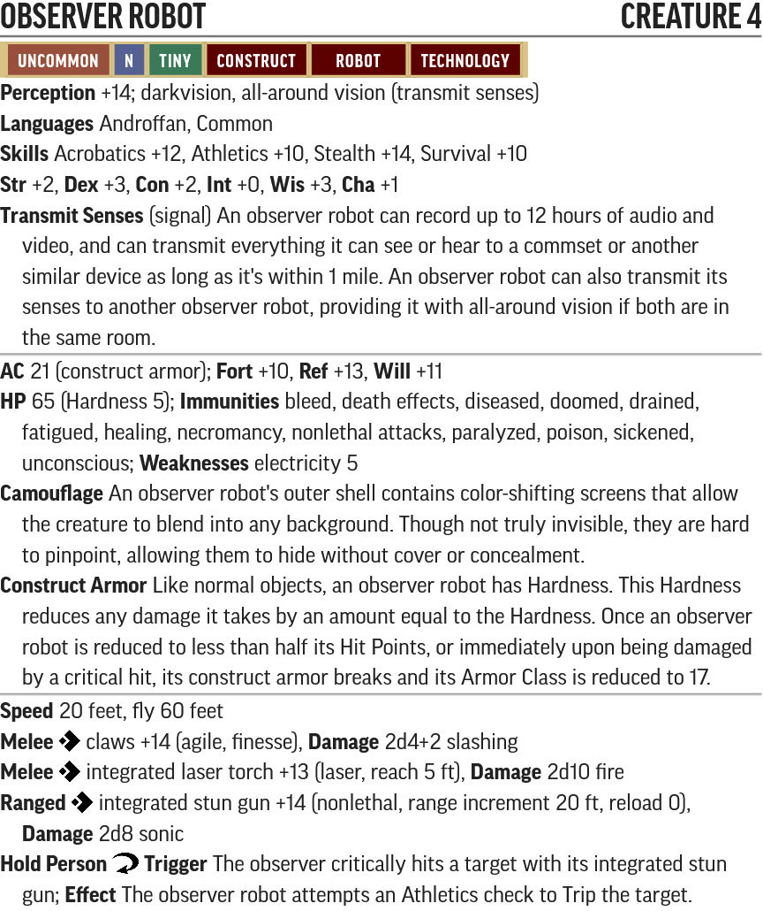

* [PF2 Tools JSON](PF2Tools/ObserverRobot.json)
* [PDF](PDFs/ObserverRobot.pdf)