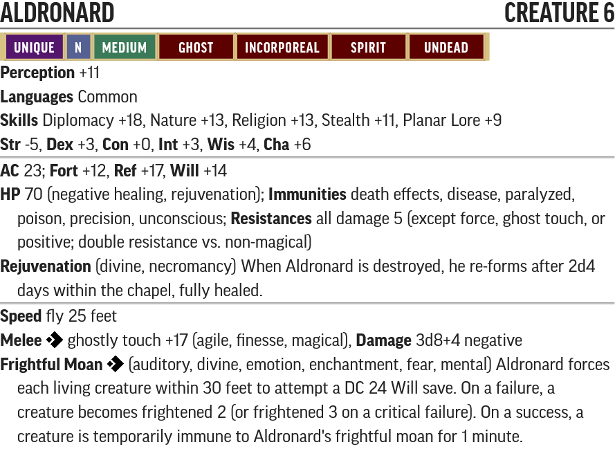

Lords of Rust - Creature Statblocks

Any listed items with a carat (^) at the end is a item that does not exist in the current Pathfinder 2e SRD. These items will be linked below their statblock.

For creatures with new traits like Technology, Robot and Extraterrestrial, please see their entry in the [New Traits](/Technology%20Guide/Traits/README.md) document.

## Named NPCs

### Ewhar Vress

* [PF2 Tools JSON](PF2Tools/EwharVress.json)
* [PDF](PDFs/EwharVress.pdf)

Hatchet-Hand is fashioned after an [Antipaladin](https://2e.aonprd.com/NPCs.aspx?ID=961) for their proficiency in Intimidation. Their hatchet-hand has the [free-hand](https://2e.aonprd.com/Traits.aspx?ID=181) trait so people can't disarm it.

#### Ewhar Vress' Items

* 2x [Gas Grenade^](../Items/README.md#gas-grenade)
* 2x [Soothe^](../Items/README.md#soothe)

### Aldronard

* [PF2 Tools JSON](PF2Tools/Aldronard.json)
* [PDF](PDFs/Aldronard.pdf)

Aldronard is a mix of [Hungry Ghost](https://2e.aonprd.com/Monsters.aspx?ID=1863) and Chandriu Invisar from the Abomination Vaults adventure path.

## New Creatures

### Smiler

* [PF2 Tools JSON](PF2Tools/Smiler.json)
* [PDF](PDFs/Smiler.pdf)

Smilers are built as a [Archer Sentry](https://2e.aonprd.com/NPCs.aspx?ID=934) but with more focus on getting crits.

#### Smiler's Items

* [Soothe^](../Items/README.md#soothe)