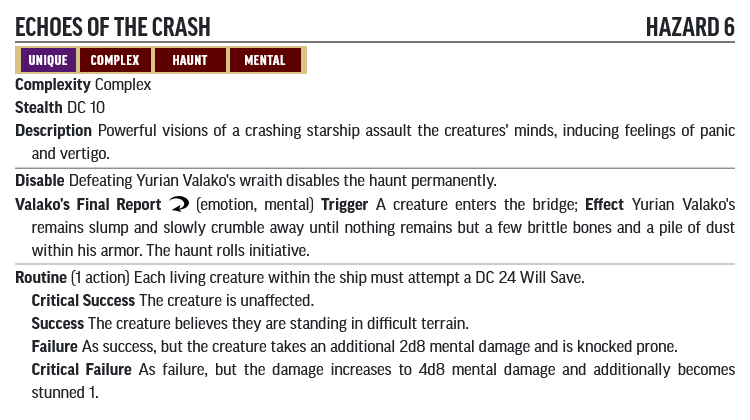

# Hazard Statblocks

Use the PF2 Tools JSON files with [https://template.pf2.tools/]. Be aware these do **NOT** import directly into FoundryVTT.

## H. Smilers' Headquarters

### Laser Turret

* [JSON](LaserTurret.json)
* [PDF](LaserTurret.pdf)

## P. Haunted Wreck

### Echoes of the Crash

* [JSON](EchoesOfTheCrash.json)
* [PDF](EchoesOfTheCrash.pdf)