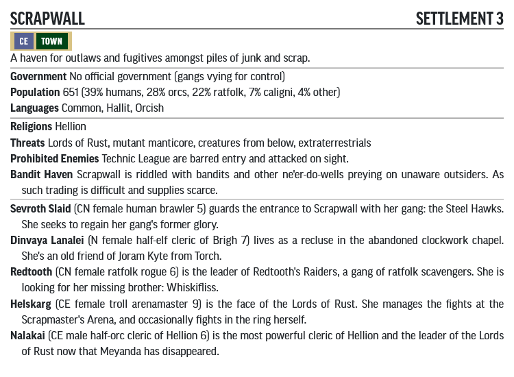

# Lords of Rust Lv 5-9

## Table of Contents

- [Part 1: Aldronard's Grave](#part-1-aldronards-grave)
- [Part 2: Becoming Scrap-Worthy](#part-2-becoming-scrap-worthy)
- [Area D: Hawk Palace](#d-hawk-palace)
- [Area F: The Clockwork Chapel](#f-the-clockwork-chapel)
- [Area H: Smilers' Headquarters](#h-smilers-headquarters)
- [Area J: Redtooth's Warren](#j-redtooths-warren)
- [Area K: Manticore Lair](#k-manticore-lair-40-xp-trivial-threat)
- [Area N: Receiver Array](#n-receiver-array)
- [Area P: Haunted Wreck](#p-haunted-wreck)
- [Part 3: Hellion's Domain](#part-3-hellions-domain)
- [Area Q: Scrapmaster's Arena](#q-scrapmasters-arena)
- [Area R: Temple of Hellion](#r-temple-of-hellion)
- [Area S: Underlevels](#s-underlevels)
- [Area T: Excavator Arm](#t-excavator-arm)
- [Scrapwall Gazetteer](#scrapwall-gazetteer)
- [Scrapwall Encounters](#scrapwall-encounters)

## Advancement Track

Level | XP Progression                          | Milestone
------|-----------------------------------------|----------
5     | PCs begin at Lv 5                       | PCs begin at Lv 5
6     | Around completing Area D                | After completing Area D
7     | Around completing Area J                | After completing Area H
8     | After clearing Scrapmaster's Arena (Q1) | After clearing Scrapmaster's Arena (Q1)
9     | After completing Part 3                 | After completing Part 3

## Part 1: Aldronard's Grave

### Power Relay

- **Skills:**
  - **Recall Knowledge (Numerian Geography Lore, Engineering Lore or Society): DC20 -** If a player can speak Androffan, they can confirm the device was transmitting power to a spot 105 miles northeast from Torch - Scrapwall.

### Ensuring Torch's Safety

The town offers to pay the PCs a reward of 450 gp if they can ensure no further threat faces Torch.

### Contacting Dinvaya

Joram Kyte promises to give the PCs his [*wand of continuation (1st-level spell)*](https://2e.aonprd.com/Equipment.aspx?ID=369) as a reward once they complete his mission.

### A1. Barbican

- **Skills:**
  - **Climb (Athletics): DC20 -** To scale the stone walls.
  - **Force Open (Athletics): DC 28-** To force open the iron portcullis.
  - **Force Open (Athletics): DC 25-** To force open the wooden doors.

The portcullis has Hardness 15, 60 HP (30 BT). Should the portcullis be dropped use the stats of a [Slamming Door](https://2e.aonprd.com/Hazards.aspx?ID=3) trap.

The wooden doors are both locked with an [average lock](https://2e.aonprd.com/Equipment.aspx?ID=30). The doors have Hardness 5, 20 HP (10 BT)

### A2. Courtyard (115XP, Severe Threat)

- **Creatures:**
  - 5x [Smiler^](Creatures/README.md#smiler)
  - 1x [Ewhar "Hatchet-Hand" Vress^](Creatures/README.md#ewhar-vress)

The book is very loose on where the Smilers are actually placed. It is expected they patrol or wander around the camp.

### A3. Ruined Keep

- **Skills:**
  - **Recall Knowledge (Medicine): DC20 -** To recognise the flesh being cooked as human.

### A5. Ruined Chapel (60XP, Low Threat)

- **Creatures:**
  - 1x [Aldronard^](Creatures/README.md#aldronard)

- **XP Award:** Award PCs an additional 80 XP if they manage to put Aldronard to rest.

If the PCs put Aldronard to rest, they each gain [Sarenrae](https://2e.aonprd.com/Deities.aspx?ID=16)'s Minor Boon.

### A6. Ruined Stable

- **Skills:**
  - **Recall Knowledge (Butcher Lore, Medicine): DC15 -** To recognise the bodies as having been carved for meat.

### A7. Watchtower (80XP, Moderate Threat)

- **Creatures:** 
  - 2x [Smiler^](Creatures/README.md#smiler)
  - Captain Andalen - Use the stats for a [Virtuous Defender](https://2e.aonprd.com/NPCs.aspx?ID=969)
  - Rezouln, Tanea & Sindre - Use the stats for a [Guard](https://2e.aonprd.com/NPCs.aspx?ID=933)

## Part 2: Becoming Scrap-worthy

### Scrap-Worth

Award the PCs the following XP when they reach certain levels of Scrap-Worth:

- **Scrap-Worth 2:** Award PCs 40 XP.
- **Scrap-worth 4:** Award PCs 60 XP.
- **Scrap-Worth 6:** Award PCs 80 XP.
- **Scrap-Worth 8:** Award PCs 120 XP.
- **Scrap-Worth 10:** Award PCs 160 XP.

### Exploring Scrapwall

- **Skills in General:**
  - **Climb (Athletics): DC15 -** To scale the junk walls.
  - **Seek (Perception): DC24 -** To find the hidden entrance into Area H.

### B. Entrance to Scrapwall

#### B1. Front Gate

- **Skills:**
  - **Force Open (Athletics): DC25 -** To force open the gate.

The front gate has Hardness 8, HP 50 (BT 25). 

#### B2. Guard Post (15 XP, Trivial Threat)

- **Creatures:** 
  - Steel Hawk Brigand - Use the stats for a [Bandit](https://2e.aonprd.com/NPCs.aspx?ID=887) but with a [Longbow](https://2e.aonprd.com/Weapons.aspx?ID=76) instead of the sling.

#### B3. Observation Post (15 XP, Trivial Threat)

- **Skills:**
  - **Seek (Perception): DC20 -** To notice the arrow slit.
- **Creatures:** 
  - Steel Hawk Brigand - Use the stats for a [Bandit](https://2e.aonprd.com/NPCs.aspx?ID=887) but with a [Longbow](https://2e.aonprd.com/Weapons.aspx?ID=76) instead of the sling.

#### B4. Common Room (60 XP, Low Threat)

- **Creatures:** 
  - 2x Steel Hawk Brigand - Use the stats for a [Bandit](https://2e.aonprd.com/NPCs.aspx?ID=887) but with a [Longbow](https://2e.aonprd.com/Weapons.aspx?ID=76) instead of the sling.
  - 1x [Sevroth Slaid^](Creatures/README.md#sevroth-slaid)

- **XP Award:** If the PCs enter into an alliance with the Steel Hawks to take down Birdfood, award them an additional 300 XP

#### B5. Bunkhouse (30 XP, Trivial Threat)

- **Creatures:** 
  - 2x Steel Hawk Brigand - Use the stats for a [Bandit](https://2e.aonprd.com/NPCs.aspx?ID=887) but with a [Longbow](https://2e.aonprd.com/Weapons.aspx?ID=76) instead of the sling.

### C. Steel Hawks Territory (90 XP, Moderate Threat)

- **Creatures:** 
  - 9x [Orc Warrior](https://2e.aonprd.com/Monsters.aspx?ID=325)

### D. Hawk Palace

There's a total of 6 [Orc Warriors](https://2e.aonprd.com/Monsters.aspx?ID=325) in the palace. 1d4 are in D1, and the rest are in D3.

#### D1. Walkway (10 - 40 XP, Trivial Threat)

- **Creatures:** 
  - 1d4 [Orc Warrior](https://2e.aonprd.com/Monsters.aspx?ID=325)

#### D3. Barracks (20 - 50 XP, Trivial to Low Threat)

- **Creatures:** 
  - 2x - 5x [Orc Warrior](https://2e.aonprd.com/Monsters.aspx?ID=325)

#### D5. Throne Room (60 XP, Low Threat)

- **Creatures:**
  - [Birdfood^](Creatures/README.md#birdfood)
  - Kij, Rej & Yarkus - Use the stats for an [Elite Eagle](https://2e.aonprd.com/Monsters.aspx?ID=172) for each of them.

#### D6. Birdfood's Den

- **Loot:** Dented metal locker
  - 1x [Wand](https://2e.aonprd.com/Equipment.aspx?ID=368) of [*grease*](https://2e.aonprd.com/Spells.aspx?ID=140)
  - 1x [Scroll](https://2e.aonprd.com/Equipment.aspx?ID=640) of [*sound burst*](https://2e.aonprd.com/Spells.aspx?ID=292)
  - 1x *[+1](https://2e.aonprd.com/Equipment.aspx?ID=281) [striking](https://2e.aonprd.com/Equipment.aspx?ID=280) [crossbow](https://2e.aonprd.com/Weapons.aspx?ID=67)*
  - 1x White access keycard
  - 1x [Timeworn fire extinguisher^](/Technology%20Guide/Gear/README.md#fire-extinguisher)
  - 4x Silverdisks
  - 57 gp, 6 sp, s cp

### F. The Clockwork Chapel

#### F1. Clockwork Facade

- **Skills:**
  - **Seek (Perception): DC25 -** To notice the hidden switch that opens the iron gear doors.
  - **Force Open (Athletics): DC30 -** To force open the iron gear doors.
  - **Disable a Device (Thievery): DC25 -** To disable the iron gear doors.

The iron gear doors have Hardness 18, 72 HP (36 BT).

#### F3. Chapel (40 XP, Trivial Threat)

- **Creatures:**
  - [Junk Golem^](Creatures/README.md#junk-golem)

#### F5. Workshop (60 XP, Low Threat)

- **Creatures:**
  - [Dinvaya Lanalei^](Creatures/README.md#dinvaya-lanalei)

### G. Smiler's Territory (40 XP, Trivial Threat)

- **Creatures:**
  - 4x [Smiler^](Creatures/README.md#smiler)

### H. Smilers' Headquarters

#### H1. Facade (40 XP, Low Threat)

- **Hazards:**
  - [Laser Turret^](Hazards/README.md#laser-turret)
- **Loot:**
  - [Timeworn Laser Rifle^](/Technology%20Guide/Weapons/README.md#laser-rifle) - If the Laser Turret was deactivated without breaking it or it expending all its charges.

#### H2. Waiting Room (60 - 100 XP, Low to Moderate Threat)

- **Creatures:**
  - [Gunshy^](Creatures/README.md#gunshy)

It takes the Smilers in H3 three total actions to open the doors should they wish to join the fray.

#### H3. Barracks (40 XP, Low Threat)

- **Creatures:**
  - 4x [Smiler^](Creatures/README.md#smiler)

#### H4. Specimen Storage (100 XP, Moderate Threat)

- **Creatures:**
  - 8x [Husk Zombie](https://2e.aonprd.com/Monsters.aspx?ID=1919)
  - [Whiskifliss^](Creatures/README.md#whiskifliss)

#### H5. Surgery (60 XP, Low Threat)

- **Creatures:**
  - 3x [Rust Risen^](Creatures/README.md#rust-risen)

#### H6. Marrow's Inner Sanctum (100 XP, Moderate Threat)

- **Creatures:**
  - [Marrow^](Creatures/README.md#marrow)
  - 4x Elite [Plague Zombies](https://2e.aonprd.com/Monsters.aspx?ID=424)
- **Loot:**
  - 14x [Soothe^](Items/README.md#soothe)
  - 3x [Gas Grenade^](Items/README.md#gas-grenade)
  - 2x [Scroll](https://2e.aonprd.com/Equipment.aspx?ID=640) of [*2nd level animate dead*](https://2e.aonprd.com/Spells.aspx?ID=666)
  - 1x [Scroll](https://2e.aonprd.com/Equipment.aspx?ID=640) of [*bind undead*](https://2e.aonprd.com/Spells.aspx?ID=22)
  - 1x [Scroll](https://2e.aonprd.com/Equipment.aspx?ID=640) of [*technomancy^*](/Technology%20Guide/README.md#technomancy)
  - 7x [Battery^](/Technology%20Guide/Gear/README.md#battery)
  - 22x Silverdisks
  - 53 gp, 6 sp

### I. Redtooth's Raiders Territory (40 XP, Trivial Threat)

- **Creatures:**
  - 4x [Smiler^](Creatures/README.md#smiler)
  - 4x Ratfolk - Use the stats for an [Urchin](https://2e.aonprd.com/NPCs.aspx?ID=899)

### J. Redtooth's Warren

- **XP Award:** If the PCs safely escort Whiskifliss here, award them 200 XP.

#### J1. Entrance Warrens

- **Skills:**
  - **Seek (Perception): DC 24 -** To notice the secret doors.

#### J2. Rat Nest (0 XP (?), Trivial Threat)

- **Creatures:**
  - 6x Elite [Giant Rat](https://2e.aonprd.com/Monsters.aspx?ID=346)

#### J3. Guard Room (60 XP, Low Threat)

- **Creatures:**
  - 6x Ratfolk Defender - Use the stats for a [Saboteur](https://2e.aonprd.com/NPCs.aspx?ID=959) but add the Swarming ability from [Ratfolk Grenadier](https://2e.aonprd.com/Monsters.aspx?ID=348)

#### J4. Rust Monster Pen (20 XP, Trivial Threat)

- **Creatures:**
  - 1x Elite [Rust Monster](https://2e.aonprd.com/Monsters.aspx?ID=354)

#### J5. Redtooth's Throne (80 XP, Moderate Threat)

- **Creatures:**
  - 4x Ratfolk Defender - Use the stats for a [Saboteur](https://2e.aonprd.com/NPCs.aspx?ID=959) but add the Swarming ability from [Ratfolk Grenadier](https://2e.aonprd.com/Monsters.aspx?ID=348)
  - [Redtooth^](Creatures/README.md#redtooth)

- **XP Award:** If the players ally with Redtooth award them an additional 200 XP.

#### J6. Redtooth's Lair

- **Loot:**
  - 5x [Battery^](/Technology%20Guide/Gear/README.md#battery)
  - 2x [Nanite Canister^](/Technology%20Guide/Gear/README.md#nanite-canister)
  - 1x [Flare Gun^](/Technology%20Guide/Weapons/README.md#flare-gun)
  - 2x [Arc Grenade^](/Technology%20Guide/Gear/README.md#grenade)
  - 1x [Flechette Grenade^](/Technology%20Guide/Gear/README.md#grenade)
  - 3x [Zero Grenade^](/Technology%20Guide/Gear/README.md#grenade)
  - 1x [Trauma Pack Plus^](/Technology%20Guide/Gear/README.md#trauma-pack-plus)
  - 1x [Timeworn Detonator^](/Technology%20Guide/Gear/README.md#detonator)

### K. Manticore Lair (40 XP, Trivial Threat)

- **Creatures:**
  - 1x Elite [Manticore](https://2e.aonprd.com/Monsters.aspx?ID=294) - add the special ability of exposing anyone hit with its jaw Strike to [Low Radiation^](/Technology%20Guide/README.md#radiation)
- **Hazards:**
  - The Manticore's nest is hazardous terrain that deals 5 points of slashing damage to any non-Manticore creature that moves through a square or ends its turn there.
- **Loot:** 
  - Rusted Iron Coffer (Force Open DC 15)
    - 1x *[+1](https://2e.aonprd.com/Equipment.aspx?ID=281) [cold iron](https://2e.aonprd.com/Equipment.aspx?ID=375) [dagger](https://2e.aonprd.com/Weapons.aspx?ID=3)*
    - 5 gp, 4sp
  - 1x *[+1](https://2e.aonprd.com/Equipment.aspx?ID=281) [striking](https://2e.aonprd.com/Equipment.aspx?ID=280) [greataxe](https://2e.aonprd.com/Weapons.aspx?ID=21)*
  - 1 gp, 4 cp
  - 1x [*ring of the ram*](https://2e.aonprd.com/Equipment.aspx?ID=461)
  - 1x [EMP Pistol^](/Technology%20Guide/Weapons/README.md#emp-pistol)

### M. Thralls of Hellion Territory (40 XP, Trivial Threat)

- **Creatures:**
  - 4x [Choker](https://2e.aonprd.com/Monsters.aspx?ID=583)

### N. Receiver Array

- **Skills:**
  - **Recall Knowledge (Engineering Lore): DC18 -** To know where to place the [cylex^](/Technology%20Guide/Gear/README.md#cylex).
  - **Climb (Athletics): DC15 -** To reach the support structures of the array.
  - **Disable a Device (Thievery): DC13 -** To arm the [cylex^](/Technology%20Guide/Gear/README.md#cylex)
- **XP Award:** If the PCs successfully destroy the receiver array, award them 200 XP.

#### N4. Holding Chamber

The door is made from [glaucite^](/Technology%20Guide/README.md#glaucite) (Hardness 9, HP 36 (BT 18))

#### N6. Rhu-Chalik Den (40 XP, Trivial Threat)

- **Creatures:**
  - 1x Elite [Rhu-Chalik](https://2e.aonprd.com/Monsters.aspx?ID=1276)

### O. Haunted Canyon (80 XP, Moderate Threat)

- **Creatures:**
  - 4x [Poltergeist](https://2e.aonprd.com/Monsters.aspx?ID=334)

### P. Haunted Wreck

#### P2. Cargo Bay (60 XP, Low Threat)

- **Creatures:**
  - 3x [Poltergeist](https://2e.aonprd.com/Monsters.aspx?ID=334)
- **Loot:** 
  - 1x [Timeworn Grenade Launcher^](/Technology%20Guide/Weapons/README.md#grenade-launcher)
  - 3x [Concussion Grenade^](/Technology%20Guide/Gear/README.md#grenade)
  - 1x [Timeworn Emergency Beacon^](/Technology%20Guide/Gear/README.md#emergency-beacon)
  - 1x [Timeworn Emergency Raft^](/Technology%20Guide/Gear/README.md#emergency-raft)
  - 1x [Timeworn Emergency Shelter^](/Technology%20Guide/Gear/README.md#emergency-shelter)
  - 3x [Cylex^](/Technology%20Guide/Gear/README.md#cylex)
  - 43x Silverdisks

#### P3. Engine Room (40 XP, Trivial Threat)

- **Creatures:**
  - 1x [Will-o'-wisp](https://2e.aonprd.com/Monsters.aspx?ID=414)

#### P4. Stasis Pods (60 XP, Low Threat)

- **Creatures:**
  - 4x [Skeletal Technician^](Creatures/README.md#skeletal-technician)
- **Loot:**
  - 4x Gray Access Keycard

#### P5. Bridge (70 XP, Low Threat)

- **Hazards:**
  - 1x [Echoes of the Crash^](Hazards/README.md#echoes-of-the-crash)
- **Creatures:**
  - 1x Yurian Valako, an Elite [Wraith](https://2e.aonprd.com/Monsters.aspx?ID=417)
- **Loot:**
  - 1x [Timeworn Mind Burner^](Items/README.md#mind-burner)
  - 1x [Scatterlight Suit^](/Technology%20Guide/Armor/README.md#scatterlight-suit)
  - 1x [Envoy's Mouthpiece^](Items/README.md#envoys-mouthpiece)
  - 1x [Skillslot^](/Technology%20Guide/Cybertech/README.md#skillslot)
  - 1x [Inhibitor Facet^](Items/README.md#memory-facet)
 - **XP Award:** If the PCs successfully decipher the message from the Envoy's Mouthpiece, award them 200 XP.

## Part 3: Hellion's Domain

### Scrap-Worth Repercussions

Depending on the PC's Scrap-Worth, there may be additional encounters in the following areas.   

- **Scrap-Worth 8-9:** Bolster the encounters with the Lords of Rust by 20 XP.
- **Scrap-Worth 4-7:** Bolster the encounters with the Lords of Rust by 20 XP and add 8 40 XP encounters to various rooms in the complex.
- **Scrap-Worth 1-3:** Bolster the encounters with the Lords of Rust by 20 XP, add 8 40 XP encounters to various rooms in the complex and every level of the complex except Area T gains a patrol of Caligni (see below)
- **Scrap-Worth 0:** As Scrap-Worth 1-3, but every encounter has one of the lowest-level creatures replaced with an elite.

The extra XP and encounters are built from the following list. Each of the following choices is worth 10 XP. e.g. 2x Elite Chokers and 2x Acolyte of Hellions would make an encounter of 30 XP.

- 2x Elite [Chokers](https://2e.aonprd.com/Monsters.aspx?ID=583) - Unless the PCs have collapsed the Receiver Array in Area N.
- 2x Elite [Smilers^](Creatures/README.md#smiler) - Unless the PCs have defeated Marrow in Area H.
- 1x [Ratfolk Grenadier](https://2e.aonprd.com/Monsters.aspx?ID=348) - Unless the PCs have allied with Redtooth in Area J.
- 1x Elite [Caligni Slayer](https://2e.aonprd.com/Monsters.aspx?ID=577) - If the PCs are in Area S.
- 1x [Orc Fanatic^](Creature/README.md#orc-fanatic)
- 1x [Acolyte of Hellion^](Creatures/README.md#acolyte-of-hellion)

**Caligni Patrol**
  - 1x Elite [Caligni Vanguard](https://2e.aonprd.com/Monsters.aspx?ID=1087)
  - 2x [Caligni Caller](https://2e.aonprd.com/Monsters.aspx?ID=1088)

### Q. Scrapmaster's Arena

#### Q1. Scrapmaster's Arena (120 - 140 XP, Severe Threat)

- **Creatures**
  - 1x [Helskarg^](Creatures/README.md#helskarg)
  - 2x Elite [Ogre Glutton](https://2e.aonprd.com/Monsters.aspx?ID=318)

If PCs have a Scrap-Worth lower than 10, add 20 XP to this encounter - See [Scrap-Worth Repercussions](#scrap-worth-repercussions)

#### Q2. Helskarg's Stage

- **Creatures:**
  - 1x [Hellion^](Creatures/README.md#hellion)

Hellion is the first [Artificial Intelligence](/Traits/README.md#ai) in this adventure. It is present for pretty much the rest of the adventure. It can cast spells from any of the glowing red Hellion Monitors, and if PCs do not obey the command to kneel, Hellion casts [*divine wrath*](https://2e.aonprd.com/Spells.aspx?ID=86) (evil) at 4th level from the monitors outside the doors into Q3.

Hellion Monitors have Hardness 5, HP 20 (BT 10) - PCs should be encouraged to smash them.

### R. Temple of Hellion

#### R1. Temple of Hellion (100 - 120 XP, Moderate to Severe Threat)

- **Creatures:**
  - 1x [Nalakai^](Creatures/README.md#nalakai)
  - 8x [Acolyte of Hellion^](Creatures/README.md#acolyte-of-hellion)

If PCs have a Scrap-Worth lower than 10, add 20 XP to this encounter - See [Scrap-Worth Repercussions](#scrap-worth-repercussions)

#### R2. Nalakai's Quarters

- **Skills:** 
  - **Decipher Writing (Society): DC15 -** To decipher the meaning of Nalakai's prayer book (need to speak Orcish)
  - **Recall Knowledge (Numerian Lore): DC10 -** To deduce this bigger threat is under Silver Mount.
- **XP Award:** If the PCs find Nalakai's quarters and successfully decipher it award them a 100 XP

### R4. Backup Batteries (60 XP, Low Threat)

- **Creatures:**
  - 2x [Scrapyard Robot^](Creatures/README.md#scrapyard-robot)

### R5. Sacrifice Disposal Pit (30 XP, Trivial Threat)

- **Creatures:**
  - 1x [Black Pudding](https://2e.aonprd.com/Monsters.aspx?ID=323)

Note that [glaucite^](/Technology%20Guide/README.md#glaucite) isn't affected by the Black Pudding's Corrosive Touch and Corrosive Mass abilities.

### S. Underlevels.

For XP advancement, it should be noted that players do not have to clear every room on this floor to proceed.

#### S2. Guardpost (45 XP, Trivial Threat)

- **Creatures:**
  - 3x Elite [Caligni Stalker](https://2e.aonprd.com/Monsters.aspx?ID=66)

#### S3. Central Processor (40 XP, Trivial Threat)

- **Skills:**
  - **Force Open (Athletics): DC 34 -** To force open the doors to the room.
  - **Recall Knowledge (Engineering Lore): DC 20 -** To realise the [inhibitor facet^](Items/README.md#memory-facet) from Area P5 can be slotted in here to inhibit Hellion.
  - **Seek (Perception): DC 29 -** To realise one of the slots on the central processor looks like it'd fit the [inhibitor facet^](Items/README.md#memory-facet)

The doors to the room have Hardness 10, HP 40 (BT 20).

- **Creatures:**
  - 4x [Observer Robot^](Creatures/README.md#observer-robot)

The central processor has Hardness 9, HP 36 (BT 18).

#### S4. Control Room (120 - 140 XP, Severe Threat)

- **Creatures:**
  - 1x Elite [Caligni Slayer](https://2e.aonprd.com/Monsters.aspx?ID=577)
  - 5x [Orc Fanatic^](Creatures/README.md#orc-fanatic)
  - 1x [Kulgara^](Creatures/README.md#kulgara)

#### S6. Kulgara's Quarters

- **Loot:** On top of cabinet
  - 12x [Goo Tube^](/Technology%20Guide/Gear/README.md#goo-tube)
  - 2x [Cureall^](/Technology%20Guide/Pharmaceuticals/README.md#cureall)
- **Skills:**
  - **Force Open (Athletics): DC30 -** To force open the doors of the cabinet.
  - **Disable Device (Thievery): DC31 -** To pick the electronic locks of the cabinet.

The [glaucite^](/Technology%20Guide/README.md#glaucite) cabinet has hardness 10, HP 40 (BT 20)

- **Loot:** Inside Cabinet
  - 1x [*North Wind's Night Verse*](https://2e.aonprd.com/Equipment.aspx?ID=1068)
  - 1x [Timeworn Hard Light Shield^](/Technology%20Guide/Armor/README.md#hard-light-shield)
  - 1x [Power Cable^](/Technology%20Guide/Gear/README.md#power-cable)
  - 14 gp, 12 sp
  - 244x Silverdisks
- **XP Award:** If the PCs open this cabinet and read through her notes award them 100 XP

#### S7. Cavern Access (40 XP, Trivial Threat)

- **Skills:**
  - **Balance (Acrobatics): DC13 -** To move along the beams successfully.
- **Creatures:**
  - 2x [Caligni Caller](https://2e.aonprd.com/Monsters.aspx?ID=1088) - wearing [veemod goggles^](/Technology%20Guide/Gear/README.md#veemod-goggles) with [brown veemods^](/Technology%20Guide/Gear/README.md#veemod) to disable their light blindness.

#### S8. Tatterface's Domain (100 XP, Moderate Threat)

- **Creatures:**
  - 2x [Caligni Caller](https://2e.aonprd.com/Monsters.aspx?ID=1088)
  - 1x [Tatterface^](https://2e.aonprd.com/Monsters.aspx?ID=1088) - wearing [veemod goggles^](/Technology%20Guide/Gear/README.md#veemod-goggles) with [brown veemods^](/Technology%20Guide/Gear/README.md#veemod) to disable her light blindness.

#### S9. Toxic Slump (40 XP, Trivial Threat)

- **Creatures:**
  - 1x Elite [Chuul](https://2e.aonprd.com/Monsters.aspx?ID=81)

Creatures ending their turn in the toxic sludge must make a DC 15 Fortitude save or become sickened 1. This is a poison effect.

Drinking the toxic sludge has a 5% chance of rolling on the [Numerian Fluids](/Technology%20Guide/README.md#numerian-fluids) table and 95% chance of being afflicted by [Wolfsbane](https://2e.aonprd.com/Equipment.aspx?ID=131)

#### S10. Blood Ghost Shrine

- **Skills:**
  - **Recall Knowledge (Planar Lore): DC22 -** To recognise the creature depicted is a [Xill](https://2e.aonprd.com/Monsters.aspx?ID=866)
  - **Recall Knowledge (Occultism): DC24 -** To recognise the creature depicted is a [Xill](https://2e.aonprd.com/Monsters.aspx?ID=866)
  - **Recall Knowledge (Religion): DC15 -** To realise this is a place of worship, but not what the religion is.

#### S11. Lair of the Blood Ghost (60 - 80 XP, Low to Moderate Threat)

- **Creatures:**
  - 1x [Zagmaander^](Creatures/README.md#zagmaander)

For those wishing to help, Zagmaander's curse is a Level 5 curse, DC 26.

If PCs have a Scrap-Worth lower than 10, add 20 XP to this encounter - See [Scrap-Worth Repercussions](#scrap-worth-repercussions) (the Caligini Slayers would be the best fit here)

#### S12. Great Cavern (40 XP, Trivial Threat)

- **Creatures:**
  - 1x [Draigs^](Creatures/README.md#draigs)
- **Skills:**
  - **Balance (Acrobatics): DC13 -** To move along the beam successfully
- **Loot:** Draigs' Nest
  - 11x [Battery^](/Technology%20Guide/Gear/README.md#battery)
  - 1x [Timeworn Magboots^](/Technology%20Guide/Gear/README.md#magboots)
  - 319x Silverdisks

### T. Excavator Arm

#### T1. Observation Post (60 XP, Low Threat)

- **Creatures:**
  - 4x Elite [Observation Robot^](Creatures/README.md#observer-robot)

#### T2. Excavator Arm (60 XP, Low Threat)

- **Skills:**
  - **Recall Knowledge (Numeria or Geography Lore): DC10 -** To recognise the scrawl as Silver Mount.
  - **Recall Knowledge (Society): DC15 -** To recognise the scrawl as Silver Mount.
- **Hazards:**
  - 3x [Glyph of Warding](https://2e.aonprd.com/Spells.aspx?ID=138) - The glyph casts [*sound burst*](https://2e.aonprd.com/Spells.aspx?ID=292) at 3rd level, triggered by a any creatures walking over that aren't constructs or androids. DC 24.

#### T3. Hellion's Redoubt (170 XP, Extreme Threat)

- **Creatures:**
  - 3x [Scrapyard Robot^](Creatures/README.md#scrapyard-robot)
  - 1x [Hellion's Chassis^](Creatures/README.md#hellions-chassis)
- **XP Awards:** There should be more than enough XP for your PCs to hit level 9 here but just to be safe award them 200 XP for completing the adventure!

## Scrapwall Gazetteer

- [PF2 Tools JSON](Scrapwall/Scrapwall.json)
  - Use with [https://template.pf2.tools/]
- [PDF](Scrapwall/Scrapwall.pdf)

## Scrapwall Encounters

d%     | Result                                                                         | Encounter Level
-------|--------------------------------------------------------------------------------|----------------
01-04  | 1d6 [acolytes of Hellion^](Creatures/README.md#acolyte-of-hellion)             | 5
05-09  | 1 [scrapyard robot^](https://2e.aonprd.com/Monsters.aspx?ID=346)               | 5
10-14  | 1d6 [caligni stalker](https://2e.aonprd.com/Monsters.aspx?ID=66)               | 6
15-19  | 1d2 [junk golem](https://2e.aonprd.com/Monsters.aspx?ID=673)                   | 6
20-24  | 1d12 [husk zombies](https://2e.aonprd.com/Monsters.aspx?ID=1919)               | 6
25-29  | 1d12 [nuglubs](https://2e.aonprd.com/Monsters.aspx?ID=689)                     | 6
30-34  | 1 [mutant manticore](#k-manticore-lair-40-xp-trivial-threat)                   | 6
35-39  | 1d6 [observer robots^](Creatures/README.md#observer-robot)                     | 7
40-44  | 1d12 Elite [husk zombies](https://2e.aonprd.com/Monsters.aspx?ID=1919)         | 7
45-49  | 2 [caligni callers](https://2e.aonprd.com/Monsters.aspx?ID=1088)               | 7
50-52  | 1 [gearghost^](Creatures/README.md#gearghost)                                  | 7
53-57  | 1d12 Elite [gnagrifs](https://2e.aonprd.com/Monsters.aspx?ID=1613)             | 7
58-62  | 1d8 [rust monsters](https://2e.aonprd.com/Monsters.aspx?ID=354)                | 7
63-67  | 1d8 [caligni stalkers](https://2e.aonprd.com/Monsters.aspx?ID=661)             | 8
68-72  | 1d8 Elite [giant vultures](https://2e.aonprd.com/Monsters.aspx?ID=1362)        | 8
73-77  | 2 [black puddings](https://2e.aonprd.com/Monsters.aspx?ID=323)                 | 8
78-82  | 1d8 [rust-risen^](Creatures/README.md#rust-risen)                              | 8
83-87  | 1d6 [will-o'-wisps](https://2e.aonprd.com/Monsters.aspx?ID=414)                | 8
88-92  | 1d6 [sabosans](https://2e.aonprd.com/Monsters.aspx?ID=453)                     | 8
93-94  | 1 [ogre boss](https://2e.aonprd.com/Monsters.aspx?ID=319) & 2 [ogre gluttons](https://2e.aonprd.com/Monsters.aspx?ID=318) | 8
95-100 | a 40 XP encounter from [Scrap-worth Repercussions](#scrap-worth-repercussions) | varies