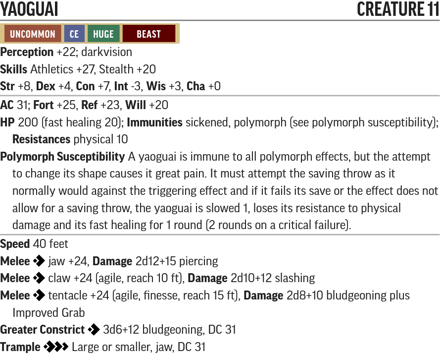

# The Choking Tower - Creature Statblocks

Any listed items with a carat (^) at the end is a item that does not exist in the current Pathfinder 2e SRD. These items will be linked below their statblock.

For creatures with new traits like Technology, Robot and Extraterrestrial, please see their entry in the [New Traits](/Traits/README.md) document.

Use the PF2 Tools JSON files with [https://monster.pf2.tools/]. Be aware these do **NOT** import directly into FoundryVTT.

## Named NPCs

### Ilaris Zeleshi

* [PF2 Tools JSON](PF2Tools/IlarisZeleshi.json)
* [PDF](PDFs/IlarisZeleshi.pdf)

Ilaris is a 10th level Magus with some spell trickster and rogue feats. She cannot cast 5th level spells because if she could she could've just cast *sending* and her cover wouldn't have been blown by the mechanical bird.

### Seerath

* [PF2 Tools JSON](PF2Tools/Seerath.json)
* [PDF](PDFs/Seerath.pdf)

#### Seerath's Items

* 1x [Scatterlight Suit^](/Technology%20Guide/Armor/README.md#scatterlight-suit)
* 1x [Timeworn Zero Pistol^](/Technology%20Guide/Weapons/README.md#zero-pistol)
* 5x [Concussion Grenade^](/Technology%20Guide/Gear/README.md#grenade)
* 2x [Battery^](/Technology%20Guide/Gear/README.md#battery)

### Furkas Xoud

* [PF2 Tools JSON](PF2Tools/FurkasXoud.json)
* [PDF](PDFs/FurkasXoud.pdf)

## New Creatures

### Yaoguai

* [PF2 Tools JSON](PF2Tools/Yaoguai.json)
* [PDF](PDFs/Yaoguai.pdf)

### Bionanite Cloud

* [PF2 Tools JSON](PF2Tools/BionaniteCloud.json)
* [PDF](PDFs/BionaniteCloud.pdf)

### Deformed Android

* [PF2 Tools JSON](PF2Tools/DeformedAndroid.json)
* [PDF](PDFs/DeformedAndroid.pdf)

#### Deformed Android's Items

* 2x [Concussion Grenade^](/Technology%20Guide/Gear/README.md#grenade)

### Gearsman Mk. II

* [PF2 Tools JSON](PF2Tools/GearsmanMkII.json)
* [PDF](PDFs/GearsmanMkII.pdf)

#### Gearsman Mk. II's Items

* 1x [Timeworn Laser Pistol^](/Technology%20Guide/Weapons/README.md#laser-pistol)

### Augmented Gearsman

* [PF2 Tools JSON](PF2Tools/AugmentedGearsman.json)
* [PDF](PDFs/AugmentedGearsman.pdf)

#### Augmented Gearsman's Items

* 1x [Timeworn Laser Rifle^](/Technology%20Guide/Weapons/README.md#laser-rifle)

### Warden Robot

* [PF2 Tools JSON](PF2Tools/WardenRobot.json)
* [PDF](PDFs/WardenRobot.pdf)

### Star Monarch

* [PF2 Tools JSON](PF2Tools/StarMonarch.json)
* [PDF](PDFs/StarMonarch.pdf)

### Riot Suppressor

* [PF2 Tools JSON](PF2Tools/RiotSuppressor.json)
* [PDF](PDFs/RiotSuppressor.pdf)