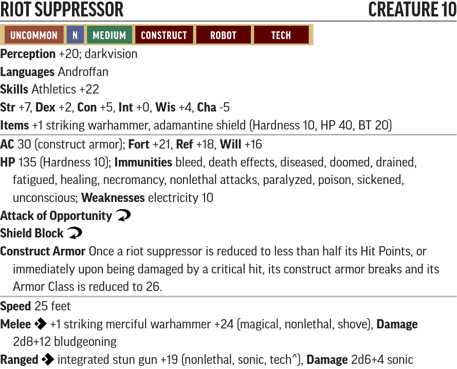
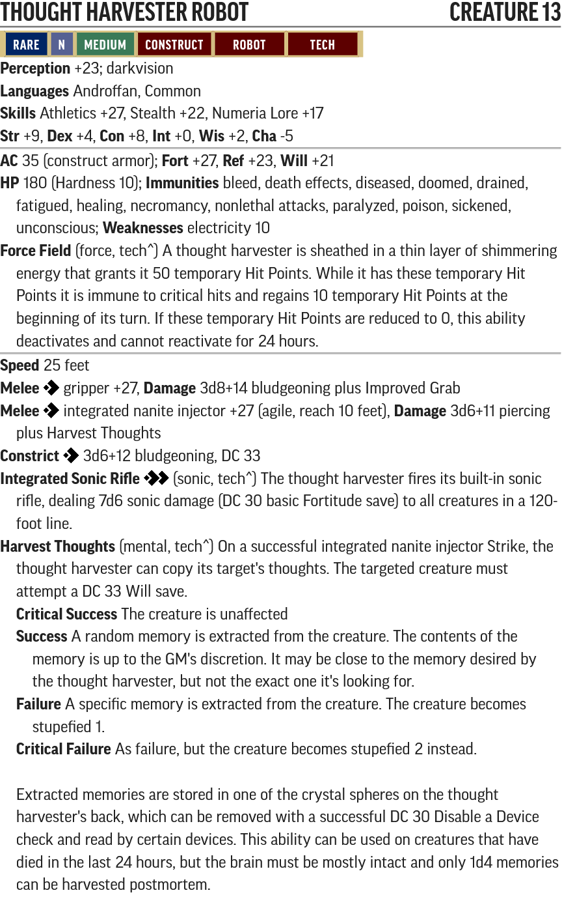

# The Choking Tower - Creature Statblocks

Any listed items with a carat (^) at the end is a item that does not exist in the current Pathfinder 2e SRD. These items will be linked below their statblock.

For creatures with new traits like Technology, Robot and Extraterrestrial, please see their entry in the [New Traits](/Traits/README.md) document.

Use the PF2 Tools JSON files with [https://monster.pf2.tools/]. Be aware these do **NOT** import directly into FoundryVTT.

## Named NPCs

### Ilarris Zeleshi

* [PF2 Tools JSON](PF2Tools/IlarrisZeleshi.json)
* [PDF](PDFs/IlarrisZeleshi.pdf)

Ilarris is built like [Mialari Docur](https://2e.aonprd.com/NPCs.aspx?ID=1561) but as a Magus. She cannot cast 5th level spells because if she could she could've just cast [*sending*](https://2e.aonprd.com/Spells.aspx?ID=272) and her cover wouldn't have been blown by the mechanical bird.

Ilarris' spellbook contains the following spells in addition to the ones she has prepared:

* **3rd** *[levitate](https://2e.aonprd.com/Spells.aspx?ID=170)*
* **2nd** *[humanoid form](https://2e.aonprd.com/Spells.aspx?ID=153), [phantom steed](https://2e.aonprd.com/Spells.aspx?ID=221)*
* **1st** *[burning hands](https://2e.aonprd.com/Spells.aspx?ID=30), [color spray](https://2e.aonprd.com/Spells.aspx?ID=44), [illusory object](https://2e.aonprd.com/Spells.aspx?ID=160)*

### Seerath

* [PF2 Tools JSON](PF2Tools/Seerath.json)
* [PDF](PDFs/Seerath.pdf)

Seerath is built as a [Scarlet Triad Sniper](https://2e.aonprd.com/NPCs.aspx?ID=1559).

#### Seerath's Items

* 1x [Scatterlight Suit^](/Technology%20Guide/Armor/README.md#scatterlight-suit)
* 1x [Timeworn Zero Pistol^](/Technology%20Guide/Weapons/README.md#zero-pistol)
* 5x [Concussion Grenade^](/Technology%20Guide/Gear/README.md#grenade)
* 2x [Battery^](/Technology%20Guide/Gear/README.md#battery)

### Cavavenchian

* [PF2 Tools JSON](PF2Tools/Cavavenchian.json)
* [PDF](PDFs/Cavavenchian.pdf)

Cavavenchian is a [Leukodaemon](https://2e.aonprd.com/Monsters.aspx?ID=90) scaled up to level 12. It no longer has *[dispel magic]*(https://2e.aonprd.com/Spells.aspx?ID=78) as that would render its trapping useless.

### Furkas Xoud

* [PF2 Tools JSON](PF2Tools/FurkasXoud.json)
* [PDF](PDFs/FurkasXoud.pdf)

### The Rockshell Snipper

* [PF2 Tools JSON](PF2Tools/TheRockshellSnipper.json)
* [PDF](PDFs/TheRockshellSnipper.pdf)

The Rockshell Snipper is a mutant cryptid variant of a Giant Snapping Turtle

## New Creatures

### Yaoguai

* [PF2 Tools JSON](PF2Tools/Yaoguai.json)
* [PDF](PDFs/Yaoguai.pdf)

### Bionanite Cloud

* [PF2 Tools JSON](PF2Tools/BionaniteCloud.json)
* [PDF](PDFs/BionaniteCloud.pdf)

### Deformed Android

* [PF2 Tools JSON](PF2Tools/DeformedAndroid.json)
* [PDF](PDFs/DeformedAndroid.pdf)

#### Deformed Android's Items

* 2x [Concussion Grenade^](/Technology%20Guide/Gear/README.md#grenade)

### Gearsman Mk. II

* [PF2 Tools JSON](PF2Tools/GearsmanMkII.json)
* [PDF](PDFs/GearsmanMkII.pdf)

#### Gearsman Mk. II's Items

* 1x [Timeworn Laser Pistol^](/Technology%20Guide/Weapons/README.md#laser-pistol)

### Augmented Gearsman

* [PF2 Tools JSON](PF2Tools/AugmentedGearsman.json)
* [PDF](PDFs/AugmentedGearsman.pdf)

#### Augmented Gearsman's Items

* 1x [Timeworn Laser Rifle^](/Technology%20Guide/Weapons/README.md#laser-rifle)

### Warden Robot

* [PF2 Tools JSON](PF2Tools/WardenRobot.json)
* [PDF](PDFs/WardenRobot.pdf)

### Star Monarch

* [PF2 Tools JSON](PF2Tools/StarMonarch.json)
* [PDF](PDFs/StarMonarch.pdf)

### Riot Suppressor

* [PF2 Tools JSON](PF2Tools/RiotSuppressor.json)
* [PDF](PDFs/RiotSuppressor.pdf)

### Mihstu

* [PF2 Tools JSON](PF2Tools/Mihstu.json)
* [PDF](PDFs/Mihstu.pdf)

### Robotic Apprentice

* [PF2 Tools JSON](PF2Tools/RoboticApprentice.json)
* [PDF](PDFs/RoboticApprentice.pdf)

### Deathtrap Ooze

* [PF2 Tools JSON](PF2Tools/DeathtrapOoze.json)
* [PDF](PDFs/DeathtrapOoze.pdf)

### Thought Harvester Robot

* [PF2 Tools JSON](PF2Tools/ThoughtHarvesterRobot.json)
* [PDF](PDFs/ThoughtHarvesterRobot.pdf)

### Irradiated Dead

* [PF2 Tools JSON](PF2Tools/IrradiatedDead.json)
* [PDF](PDFs/IrradiatedDead.pdf)

### Thorgothrel

* [PF2 Tools JSON](PF2Tools/Thorgothrel.json)
* [PDF](PDFs/Thorgothrel.pdf)