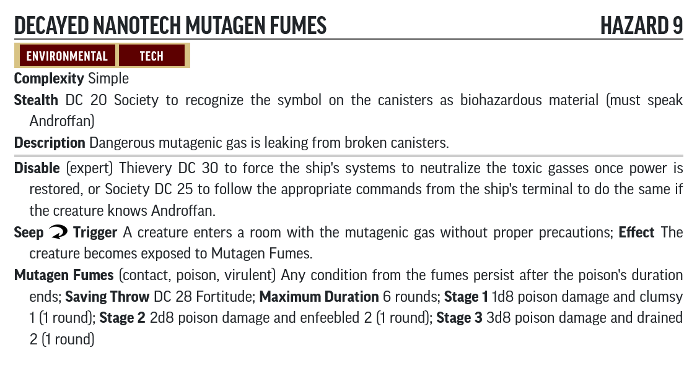
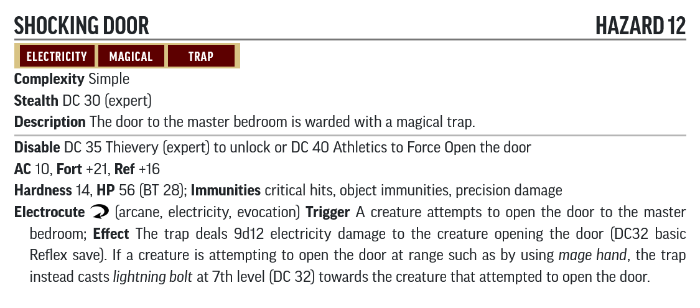

# Hazard Statblocks

Use the PF2 Tools JSON files with [https://template.pf2.tools/]. Be aware these do **NOT** import directly into FoundryVTT.

## A. Wreck of the Aurora

### Malfunctioning Doorway

* [PF2 Tools JSON](PF2Tools/MalfunctioningDoorway.json)
* [PDF](PDFs/MalfunctioningDoorway.pdf)

### Collapsing Rubble

* [PF2 Tools JSON](PF2Tools/CollapsingRubble.json)
* [PDF](PDFs/CollapsingRubble.pdf)

### Decayed Nanotech Mutagen Fumes

* [PF2 Tools JSON](PF2Tools/DecayedNanotechMutagenFumes.json)
* [PDF](PDFs/DecayedNanotechMutagenFumes.pdf)

## F. The Choking Tower

### False Hatch

* [JSON](PF2Tools/FalseHatch.json)
* [PDF](PDFs/FalseHatch.pdf)

### Belching Stove

* [JSON](PF2Tools/BelchingStove.json)
* [PDF](PDFs/BelchingStove.pdf)

### Nightmare Fumes

* [JSON](PF2Tools/NightmareFumes.json)
* [PDF](PDFs/NightmareFumes.pdf)

### Scalding Steam Spray

* [JSON](PF2Tools/ScaldingSteamSpray.json)
* [PDF](PDFs/ScaldingSteamSpray.pdf)

### Suffocating Spirits

* [JSON](PF2Tools/SuffocatingSpirits.json)
* [PDF](PDFs/SuffocatingSpirits.pdf)

### Shocking Door

* [JSON](PF2Tools/ShockingDoor.json)
* [PDF](PDFs/ShockingDoor.pdf)

### Flailing Robot Parts

* [JSON](PF2Tools/FlailingRobotParts.json)
* [PDF](PDFs/FlailingRobotParts.pdf)

### Bone-Scything Lash

* [JSON](PF2Tools/BoneScythingLash.json)
* [PDF](PDFs/BoneScythingLash.pdf)