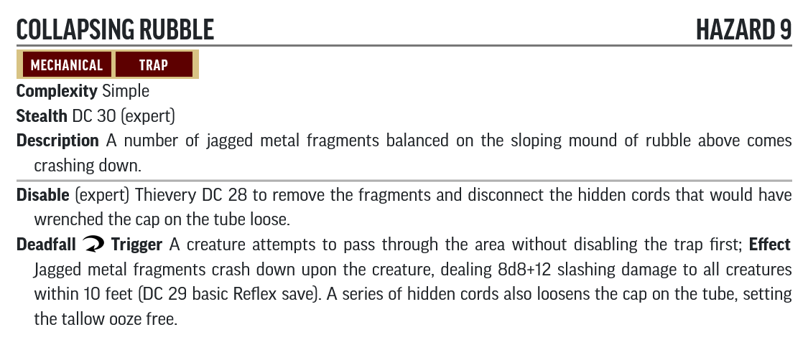

# Hazard Statblocks

Use the PF2 Tools JSON files with [https://template.pf2.tools/]. Be aware these do **NOT** import directly into FoundryVTT.

## A. Wreck of the Aurora

### Malfunctioning Doorway

* [PF2 Tools JSON](PF2Tools/MalfunctioningDoorway.json)
* [PDF](PDFs/MalfunctioningDoorway.pdf)

### Collapsing Rubble

* [PF2 Tools JSON](PF2Tools/CollapsingRubble.json)
* [PDF](PDFs/CollapsingRubble.pdf)

### Decayed Nanotech Mutagen Fumes

* [PF2 Tools JSON](PF2Tools/DecayedNanotechMutagenFumes.json)
* [PDF](PDFs/DecayedNanotechMutagenFumes.pdf)

## P. Haunted Wreck

### Echoes of the Crash

* [JSON](EchoesOfTheCrash.json)
* [PDF](EchoesOfTheCrash.pdf)