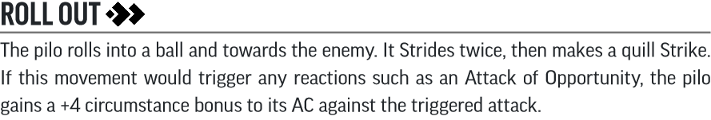
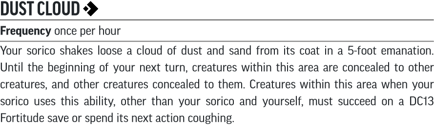

# Player Options

This attempts to convert the entries in the [Iron Gods Player's Guide](https://paizo.com/products/btpy98lf?Pathfinder-Adventure-Path-Iron-Gods-Players-Guide) into 2e. Traits are usually converted into backgrounds.

## Backgrounds

### Against the Technic League

For whatever reason, you have a grudge against the Technic League. Perhaps you suspect the League was responsible for your parents' deaths, or you could just rankle at the League's open acceptance of slavery, their reputation for sadism and cruelty, or their penchant for hoarding and controlling technological wonders.

* You get an ability boost to any two abilities of your choice.
* You are trained in the Society skill and the Technic League Lore skill. You gain the Streetwise skill feat.

### Torch Local

You have ties to a prominent local in the town of Torch - the missing wizard Khonnir Baine. If you're a wizard, alchemist or other scholarly type, he may have been your tutor or teacher. If you're of a more martial bent, Khonnir could instead have been a friend or business associate of your parents or patron. Either way your relationship has given you some insight into the residents of Torch.

* Choose two ability boosts. One must be to Constitution or Charisma, and one is a free ability boost.
* You are trained in the Diplomacy skill and the Torch (town) Lore skill. You gain the Hobnobber skill feat.

### Numerian Archaeologist

Numeria is a land ripe for archaeological exploration. You've studied the strange language associated with its eerie technological ruins, and are eager to start exploring them.

* Choose two ability boosts. One must be to Constitution or Intelligence, and one is a free ability boost.
* You are trained in the Society skill and the Engineering Lore skill. You also gain Androffan as an additional language.

### Robot Slayer

The strange automatons that plague the wilds of Numeria are a blight upon the world, and the idea that there could be countless more of these creatures lying in wait throughout the region chills your blood.

* Choose two ability boosts. One must be to Strength or Wisdom, and one is a free ability boost.
* You are trained in the Survival skill and a Regional Lore skill. You get the Assurance skill feat with a skill of your choice that you are trained in.

### Skymetal Smith

The fires atop Torch Hill have long been a boon to smiths and metalworkers. You've always been fascinated by the fires, and this was to be your first time to use the torch for your own project. You had just begun before the violet flames went out, and you hope to find a way to rekindle the flames.

* Choose two ability boosts. One must be to Constitution or Intelligence, and one is a free ability boost.
* You are trained in the Craft skill and the Skymetal Lore skill. You gain the Specialty Crafting skill feat.

### Stargazer

The concept of life on other planets far beyond Golarion has always fascinated you, and you've long hoped to learn more about what life on those other planets may have been like. Perhaps some of these aliens can be found in Numerian dungeons.

* Choose two ability boosts. One must be to Dexterity or Intelligence, and one is a free ability boost.
* You are trained in the Occultism skill and the Xenobiology Lore skill. You gain the Oddity Identification skill feat.

## Animal Companions and Familiars

Three new alien animals are introduced in [*Pathfinder Adventure Path #85: Fires of Creation (Iron Gods 1 of 6) (PFRPG)*](https://paizo.com/products/btpy95br).

### Petromin

[Petromin^](/Chapter1/Creatures/README.md#Petromin) are unfortunately too small to count as animal companions, but can be chosen as a familiar.

### Pilo

Your companion is a [Pilo^](/Chapter1/Creatures/README.md#Pilo), a bright yellow, six-legged animal covered in sharp quills.

* **Size** Small
* **Melee** (1 action) quills, **Damage** 1d6 piercing plus pilo poison
* **Str** +3, **Dex** +2, **Con** +2, **Int** -4, **Wis** +1, **Cha** +0
* **Hit Points** 8
* **Skill** Survival
* **Senses** low-light vision, scent (imprecise, 30 feet)
* **Speed** 35 feet
* **Special** The pilo's quills are coated in pilo poison, inflicting clumsy 1 to an opponent until the start of your next turn on a hit with the quill Strike.
* **Support Benefit** Your pilo embeds its quills in your foes. Until the start of your next turn, your Strikes that deal damage a creature in your pilo's reach also deal 1d4 persistent bleed damage. If your pilo is nimble or savage, the persistent bleed damage increases to 2d4.
* **Advanced Maneuver** Roll Out

### Sorico

Your companion is a [Sorico^](/Chapter1/Creatures/README.md#Sorico), a constantly mud-caked rodent with spade-like claws on its forelimbs.

* **Size** Small
* **Melee** (1 action) jaws, **Damage** 1d6 piercing
* **Melee** (1 action) claw (agile, finesse), **Damage** 1d4 slashing
* **Str** +2, **Dex** +3, **Con** +2, **Int** -4, **Wis** +1, **Cha** +0
* **Hit Points** 8
* **Skill** Stealth
* **Senses** low-light vision, scent (imprecise, 30 feet)
* **Speed** 30 feet, burrow 10 feet
* **Support Benefit** Your sorico kicks sand into your enemies' eyes. Until the start of your next turn, any creature within your sorico's reach that you damage with Strikes becomes blinded. A creature affected by this blinded condition can end it by spending an action with the manipulate trait to rub the sand out of its eyes.
* **Advanced Maneuver** Dust Cloud

## Religion

### Casandalee

While [*Pathfinder Lost Omens: Gods and Magic*](https://paizo.com/products/btq021wf?Pathfinder-Lost-Omens-Gods-Magic) offer Casandalee as a potential deity choice for clerics and champions, this adventure path is set before the Iron Goddess achieved divinity. Players hoping to choose her as a deity may consider [Brigh](http://2e.aonprd.com/Deities.aspx?ID=33) or [Irori](http://2e.aonprd.com/Deities.aspx?ID=10) as a replacement.
