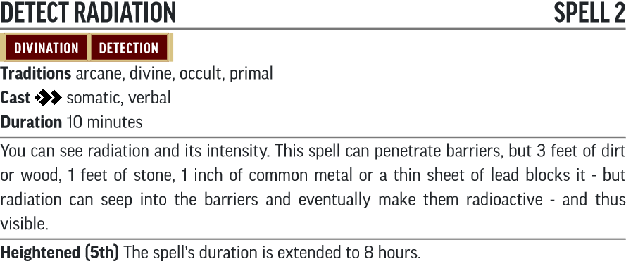
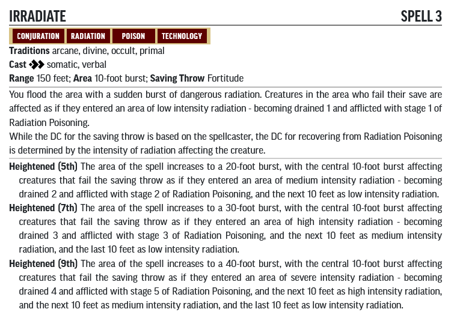
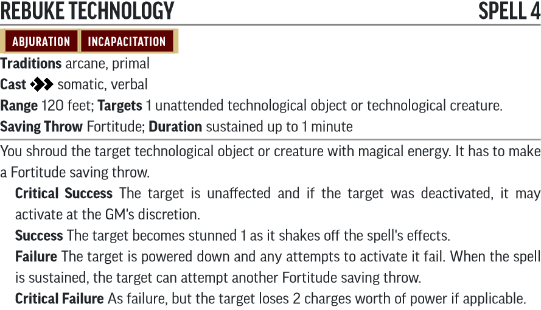
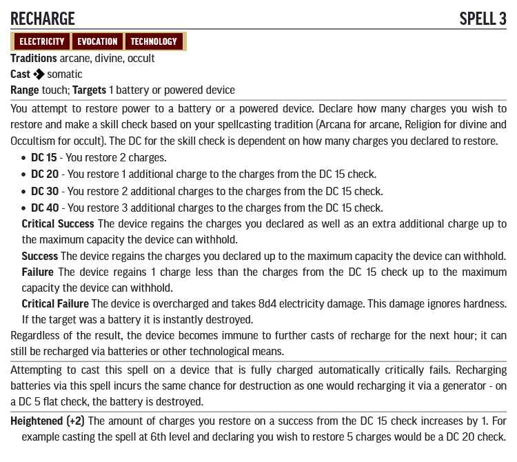
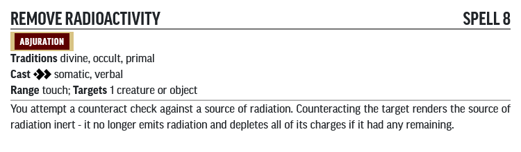
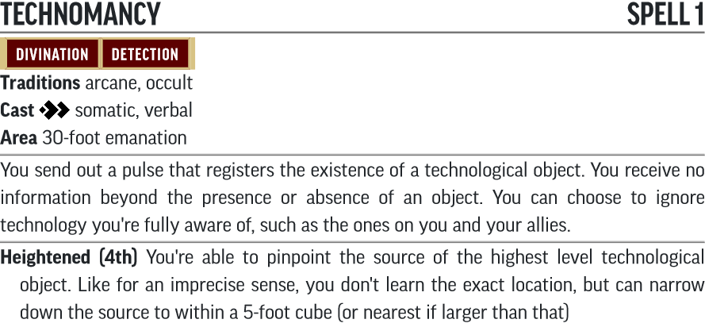

# Technology Guide

This section attempts to convert all the supplementary material to the Iron Gods adventure path that still need to be included to actually run it within 2e. Most of it will be entries from the *[Technology Guide](https://paizo.com/products/btpy98i0?Pathfinder-Campaign-Setting-Technology-Guide)* but some may be homebrewed extras to help with the conversion.

Please note that there will be **MAJOR SWEEPING CHANGES** to many items. As a GM you may wish to discuss with your players how these items are presented and what they consider to be the most important thing when converting an item, and develop your own take on things from there.

## Looking for Items?

This document covers general concepts and mechanics for an adventure in Numeria. For individual item lists, please check out the following:

* [Weapons](Weapons/README.md)
* [Armor](Armor/README.md)
* [Pharmaceuticals](Pharmaceuticals/README.md)
* [Gear](Gear/README.md)
* [Cybertech](Cybertech/README.md)

## New Traits

To see an overview of the traits that were added, please click [here](/Traits/README.md).

## Table of Contents

* [Silverdisks](#silverdisks)
* [New Actions](#new-actions)
  * [Identify Technology](#identify-technology)
  * [Identify Pharmaceutical](#identify-pharmaceutical)
* [New Spells](#new-spells)
  * [Technomancy](#technomancy)
  * [Detect Radiation](#detect-radiation)
  * [Rebuke Technology](#rebuke-technology)
* [Color Grading](#color-grading)
* [Timeworn Technology](#timeworn-technology)
* [Technological Radiation](#technological-radiation)
* [Numerian Fluids](#numerian-fluids)
* [Skymetals](#skymetals)
  * [Glaucite](#glaucite)
* [Artificial Intelligence](#artificial-intelligence)

## Silverdisks

Silverdisks are [batteries^](Gear/README.md#battery) that no longer function. They are often used as a secondary currency in Numeria.

One silverdisk is worth 1gp.

## New Actions

### Identify Technology

**Traits:** Concentrate, Exploration, Secret

You can identify the nature of a technological item with 10 minutes of testing. If your attempt is interrupted in any way, you must start over. Attempt a Engineering Lore check. You may instead make Crafting check at a -5 penalty.

If you have a [zipstick^](Gear/README.md#zipstick) on hand you can expend a use to gain a +2 item bonus to your check.

The DC of the item being identified is the same as its listed Craft DC.

* **Success** You identify the item and the means of activating it.
* **Failure** You fail to identify the item, but can try again.
* **Critical Failure** You misidentify the item as another item of the GM's choice.

### Identify Pharmaceutical

**Traits:** Concentrate, Exploration, Secret

**Requirements:** You have alchemist's tools.

You can identify the nature of a pharmaceutical item with 10 minutes of testing. If your attempt is interrupted in any way, you must start over. Attempt a Medicine check. You may instead make Crafting check at a -5 penalty.

The DC of the item being identified is the same as its listed Craft DC.

* **Success** You identify the item and the means of activating it.
* **Failure** You fail to identify the item, but can try again.
* **Critical Failure** You misidentify the item as another item of the GM's choice.

## New Feats

### Craft Cybernetics

**Level:** 9

**Traits:** Rare, General, Skill

**Prerequisites:** master in Medicine, expert in Engineering Lore

You can use the Craft activity to create cybernetic items, though many have additional requirements. Selecting this feat immediately gives you the formula of 1 [cybertech^](Cybertech/) item.

You also gain access to the [Install Cybertech^](Cybertech/README.md#install-cybertech) and [Remove Cybertech^](Cybertech/README.md#remove-cybertech) activities.

## New Spells

Spell rarity has been left up to the GM, but it's pretty safe to assume these spells are all Rare, with the only people that have access being Technic League members.

Use the JSON files with [https://template.pf2.tools/]. Be aware these do **NOT** import directly into FoundryVTT.

### Detect Radiation

* [JSON](Spells/DetectRadiation.json)
* [PDF](Spells/DetectRadiation.pdf)

### Irradiate

* [JSON](Spells/Irradiate.json)
* [PDF](Spells/Irradiate.pdf)

### Rebuke Technology

* [JSON](Spells/RebukeTechnology.json)
* [PDF](Spells/RebukeTechnology.pdf)

### Recharge

* [JSON](Spells/Recharge.json)
* [PDF](Spells/Recharge.pdf)

Recharge now works similarly to [Treat Wounds](https://2e.aonprd.com/Actions.aspx?ID=57), where it's possible to gamble with the amount recharged, but without penalising the player for "doing too well."

### Remove Radioactivity

* [JSON](Spells/RemoveRadioactivity.json)
* [PDF](Spells/RemoveRadioactivity.pdf)

This spell has been simplified to just that of the greater version as the effects of radiation can both be alleviated with *[neutralize poison](https://2e.aonprd.com/Spells.aspx?ID=207)* and *[restoration](https://2e.aonprd.com/Spells.aspx?ID=258)*

### Technomancy

* [JSON](Spells/Technomancy.json)
* [PDF](Spells/Technomancy.pdf)

## Color Grading

Technology with various grades sometimes use a color-based grading scale. The mapping is as follows.

Color Grade | Level
------------|------
Brown       | 1
Black       | 3
White       | 5
Gray        | 7
Green       | 9
Red         | 11
Blue        | 13
Orange      | 15
Prismatic   | 17

## Timeworn Technology

Items with the Timeworn trait are worth 50% of its original value, cannot be recharged and has a 50% chance of glitching under the following circumstances:

* When the item is used for the first time in a month or more of inactivty
* Any time a single-use consumable is used
* When using the item would drain its last charge
* When using an item requires a roll of a d20 and the roll results in a natural 1
* When a critical hit is confirmed against the wearer of an active defensive item, such as armor or a force field.

When an item glitches, roll a d% on the corresponding table.

### Armor Glitches

as inside cover of the Technology Guide.

### Pharmaceutical Glitches

d%     | Glitch
-------|-------
01-02  | Spoiled. Treat as poisoning by [violet venom](http://2e.aonprd.com/Equipment.aspx?ID=651).
03-11  | Spoiled. Treat as exposure to [fly pox](http://2e.aonprd.com/Diseases.aspx?ID=20).
12-20  | Spoiled. Patient is fascinated by the ceiling for 1d6 rounds.
21-30  | Spoiled. Patient is sickened 1 for 1d6 x 10 minutes (Fort DC 15)
31-40  | Spoiled. Pharmaceutical has no effect.
41-50  | Less potent. Decrease all save DCs by 2. Use minimum values for all dice rolls in effects. Decreasure durations by 50%.
51-60  | Normal effect, but patient needs to make a DC 15 Fortitude save or be drained 1.
61-75  | Normal effect, but patient needs to make a DC 15 Will save or be fascinated by the ceiling for 2d4 rounds.
76-85  | Normal effect.
86-95  | More potent. Increase any save DCs by 2. Reroll any result of 1 for effects. Increase duration by 100%.
96-100 | Far more potent. Increase any save DCs by 2. Reroll any result of 1 for effects. Increase duration by 100%. Count as two doses.

### General Glitches

as inside cover of the Technology Guide.

### Weapon Glitches

as inside cover of the Technology Guide.

## Technological Radiation

Technological radiation is a mostly invisible hazard that suffuses a spherical area and can extend into objects. Each area of radiation has an associated intensity stepping up from Low to Medium to High to Severe, and the areas work the same way as listed on *[Technology Guide, pg. 55-56](https://www.d20pfsrd.com/gamemastering/traps-hazards-and-special-terrains/hazards/environmental-hazards/radiation/)*.

Whenever a creature enters or starts their turn in an area of technological radiation, they make a single Fortitude save. On a failure, they become drained and afflicted with Radiation Poisoning, with the value and stage dependent on the intensity of radiation they were exposed to. This drained condition cannot be lowered by a full-night's rest.

Intensity | Fort DC | Drained value | Radiation Poisoning
----------|---------|---------------|--------------------
Low       | 13      | 1             | Stage 1
Medium    | 17      | 2             | Stage 2
High      | 22      | 3             | Stage 3
Severe    | 30      | 4             | Stage 5

### Radiation Poisoning

**Traits** Poison, Radiation

**Saving Throw** see table above; **Onset** 1 day; **Stage 1** enfeebled 1 (1 day); **Stage 2** enfeebled 2 (1 day); **Stage 3** enfeebled 3 (1 day); **Stage 4** enfeebled 4 (1 day); **Stage 5** 12d10 poison damage and enfeebled 5 (1 day)

## Numerian Fluids

This is a section from *[Numeria, Land of Fallen Stars, pg. 28-29](https://paizo.com/products/btpy978l?Pathfinder-Campaign-Setting-Numeria-Land-of-Fallen-Stars)* that can come up in this adventure path.

**Traits** Rare, Alchemical, Drug, Ingested

**Level** 5 **Identify Alchemy DC** 25 (20 for level 5, +5 for rarity)

**Saving Throw** DC 20 Fortitude; **Stage 1** +2 item bonus to Perception and a side effect on the Numberian Fluids table (see below) (1 hours); **Stage 2** fascinated and stupefied 2 (6 hours);

d%    | Result
------|-------
01    | The drinker's cellular structure breaks down, and their flesh dissolves off their bones. The victim dies in 1 round unless the *[regenerate](http://2e.aonprd.com/Spells.aspx?ID=248)* or *[wish](http://2e.aonprd.com/Spells.aspx?ID=377)* spell is administered.
02-04 | The drinker permanently loses a random sense (roll 1d4: 1 - hearing, 2 - sight, 3 - smell, 4 - taste). A *[regenerate](http://2e.aonprd.com/Spells.aspx?ID=248)* spell can restore it.
05-07 | The drinker ages 2d10 years.
08-10 | The drinker becomes sickened 6 and gains another side effect on this table. Reroll any result less than 15.
11-15 | The drinker becomes drained 2.
16-20 | The drinker becomes stupefied 4 and loses the ability to speak or write for 1 day.
21-30 | The drinker becomes confused.
31-35 | The drinker becomes enfeebled 2 and clumsy 2
36-40 | The drinker becomes unconscious.
41-50 | The drinker becomes stupefied 1.
51-60 | The drinker becomes sickened 1.
61-65 | The drinker becomes fascinated. Any attempts to disrupt the fascination causes the drinker to become confused.
66-70 | The drinker exudes an unpleasant stench (aura, olfactory). A creature entering this aura must succeed at a DC 20 Fortitude save or be sickened 1 (plus slowed 1 for the same duration on a critical failure).
71-75 | The drinker gains increased empathy with mechanical minds. It gains a +10 item bonus on Deception, Diplomacy and Perception checks against androids and robots, but a -5 item penalty against anyone else.
76-80 | The drinker becomes healed by a random energy type (acid, cold, fire, electricity or sonic) instead of harmed, but being healed this way inflicts stunned 1.
81-85 | The drinker's skin thickens into armor-like plates. This gives a +2 bonus to AC but they become clumsy 2. It takes 1d4 months for the skin to slough off.
86-90 | Roll twice. If the first result is below 20, add 20 to the result. If the second result is above 80, deduct 20 from the result. If it's the same roll twice, apply it once.
91-92 | The drinker gains fast healing 5 for 24 hours, but must consume twice as much food and water as normal.
93-94 | The drinker gains a +6 status bonus to a random ability score for the next 2d4 days.
95-96 | The drinker gains telepathy with a range of 100 feet for 2d4 days.
97    | The drinker gains the ability to see possible futures a few seconds ahead for 24 hours. They become fascinated. When they perform an attack roll, a skill check or a saving throw, they may declare to use the vision's guidance to reroll and take the better result. This ends the fascinated condition and the visions.
98    | The drinker becomes 1d6 years younger.
99    | The drinker foresees their death in a cryptic and disjointed vision. The next time an effect would cause their death, they can take an extra action just before they die.
100   | Roll on the exceptional Numerian Fluid Effects table below for a permanent effect!

d10 | Result
----|-------
1   | The drinker no longer dies of old age.
2   | The drinker permanently becomes under the effect of a mutagen that suits their personality.
3   | The drinker gains the ability to become incorporeal for 1d4 rounds as an action by becoming drained 1. Coming out of a phase while inside of a solid object is instantly fatal.
4   | The drinker gains either scent or echolocation as an imprecise sense of 30 feet.
5   | The drinker grows a pair of batlike wings that grant a fly speed of 25 feet.
6   | The drinker gains a +2 untyped bonus to a random ability score.
7   | The drinker's body begins to produce its own Numerian fluids, save for the fact it cannot produce exceptional effects (reroll rolls of 100).
8   | The drinker grows a metal mesh surrounding their skin which grants electricity resistance 10.
9   | The drinker's body constantly emits as much light as a hooded lantern. They may use a concentrate sustained action to suppress this effect.
10  | For 24 hours, the drinker falls into a coma and cannot be awakened. During this time, they dream of living an entire lifetime on a different planet in an alien body. The drinker gains the Bardic Lore skill at Master proficiency when they wake.

## Skymetals

Most skymetals have now been converted to second edition with the release of *[Pathfinder Lost Omens: The Grand Bazaar](https://paizo.com/products/btq027kc)*.

### Glaucite

Glaucite is an alloy of adamantine and steel that's 1.5x as heavy as steel but not much better than it. Glaucite is what the *Divinity*'s hull is made from, which is why scavengers leave these ships mostly in tact. For the sake of determining Hardness and HP for objects (likely structures if you're looking here), glaucite performs the same as steel.

Item       | Level | Hardness | HP | BT
-----------|-------|----------|----|----
Thin item  | 1     | 5        | 20 | 10
Item       | 1     | 9        | 36 | 18
Structure  | 1     | 18       | 72 | 36